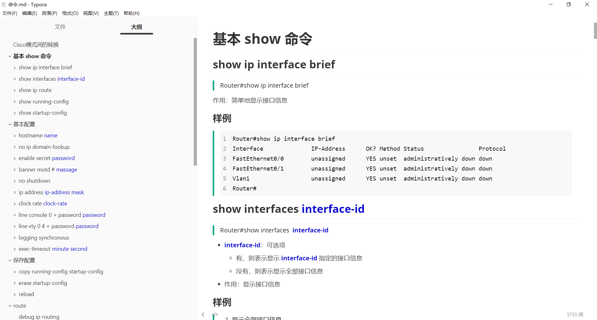

# 命令.md

最最重要的是 `命令.md` 文件，只看这个就可以了，其他都是为 `命令.md` 文件服务的附加文件。

# 正确使用方法

直接看目录！！！

直接看目录！！！

直接看目录！！！



# 打开方式

使用 [Typora](https://typora.io/)  打开 `命令.md`。没有 Typora 的可以用 `命令.pdf` ，也是直接看目录，但 `命令.pdf` 不保证最新，因为 `命令.pdf` 是由 `命令.md` 导出而来的。

## 最佳使用方式

使用 [Typora](https://typora.io/)  打开 `命令.md`，使用 Github 主题。再加上我基于 Github 的自定义主题：

文件->偏好设置->外观->主题->打开主题文件夹。在打开的主题文件夹下新建 `github.user.css` 文件，粘贴下面的代码，重启即可

```css
/* 引用 */
blockquote {
    border-left: 4px solid #1AA88B;
    color: black;
}

/* 加粗 */
strong{
    color: mediumblue;
}

/* 代码块 */
.md-fences,
code,
tt {
    border: 0px solid #ddd;
    font-size: 1em;
}
/* code 颜色及背景色 */
code {
    color: #C7254E;
    background-color: #F9F2F4;
}

/* 宽度 */
#write {
    max-width: 1000px;
}
```

