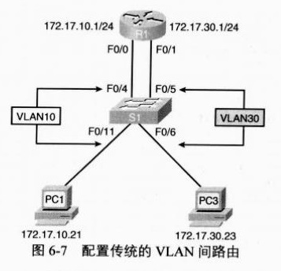
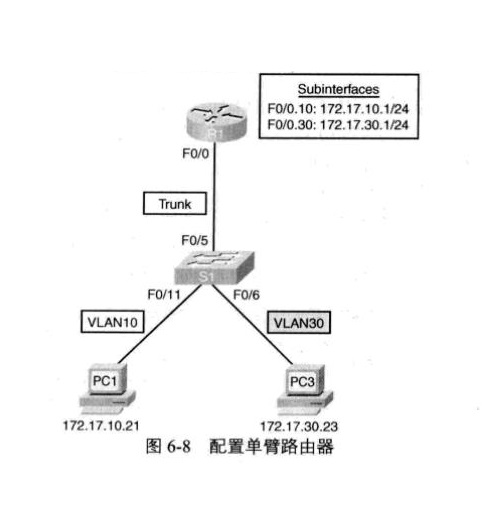

# Cisco模式间的转换


# 基本 show 命令

## show ip interface brief

> Router#show ip interface brief

作用：简单地显示接口信息

### 样例

> ```
> Router#show ip interface brief 
> Interface              IP-Address      OK? Method Status                Protocol 
> FastEthernet0/0        unassigned      YES unset  administratively down down 
> FastEthernet0/1        unassigned      YES unset  administratively down down 
> Vlan1                  unassigned      YES unset  administratively down down
> Router#
> ```

## show interfaces **interface-id**

> Router#show interfaces  **interface-id** 

- **interface-id**：可选项
  - 有，则表示显示 **interface-id** 指定的接口信息
  - 没有，则表示显示全部接口信息
- 作用：显示接口信息

### 样例
> 1. 显示全部接口信息
> 2. 显示 `FastEthernet 0/0`  接口信息 
>
> ```
>Router#show interfaces 
> FastEthernet0/0 is administratively down, line protocol is down (disabled)
> Hardware is Lance, address is 0030.a346.4801 (bia 0030.a346.4801)
> MTU 1500 bytes, BW 100000 Kbit, DLY 100 usec,
>   reliability 255/255, txload 1/255, rxload 1/255
> Encapsulation ARPA, loopback not set
> Full-duplex, 100Mb/s, media type is RJ45
> ARP type: ARPA, ARP Timeout 04:00:00, 
> Last input 00:00:08, output 00:00:05, output hang never
> Last clearing of "show interface" counters never
> Input queue: 0/75/0 (size/max/drops); Total output drops: 0
> Queueing strategy: fifo
> Output queue :0/40 (size/max)
> 5 minute input rate 0 bits/sec, 0 packets/sec
> 5 minute output rate 0 bits/sec, 0 packets/sec
>   0 packets input, 0 bytes, 0 no buffer
>   Received 0 broadcasts, 0 runts, 0 giants, 0 throttles
>   0 input errors, 0 CRC, 0 frame, 0 overrun, 0 ignored, 0 abort
>   0 input packets with dribble condition detected
>   0 packets output, 0 bytes, 0 underruns
>   0 output errors, 0 collisions, 1 interface resets
>   0 babbles, 0 late collision, 0 deferred
>   0 lost carrier, 0 no carrier
>   0 output buffer failures, 0 output buffers swapped out
> FastEthernet0/1 is administratively down, line protocol is down (disabled)
> Hardware is Lance, address is 0030.a346.4802 (bia 0030.a346.4802)
> MTU 1500 bytes, BW 100000 Kbit, DLY 100 usec,
>   reliability 255/255, txload 1/255, rxload 1/255
> Encapsulation ARPA, loopback not set
> Full-duplex, 100Mb/s, media type is RJ45
> ARP type: ARPA, ARP Timeout 04:00:00, 
> Last input 00:00:08, output 00:00:05, output hang never
> Last clearing of "show interface" counters never
> Input queue: 0/75/0 (size/max/drops); Total output drops: 0
> Queueing strategy: fifo
> Output queue :0/40 (size/max)
> 5 minute input rate 0 bits/sec, 0 packets/sec
> 5 minute output rate 0 bits/sec, 0 packets/sec
>   0 packets input, 0 bytes, 0 no buffer
>   Received 0 broadcasts, 0 runts, 0 giants, 0 throttles
>   0 input errors, 0 CRC, 0 frame, 0 overrun, 0 ignored, 0 abort
>   0 input packets with dribble condition detected
>   0 packets output, 0 bytes, 0 underruns
>   0 output errors, 0 collisions, 1 interface resets
>   0 babbles, 0 late collision, 0 deferred
>   0 lost carrier, 0 no carrier
>   0 output buffer failures, 0 output buffers swapped out
> Vlan1 is administratively down, line protocol is down
> Hardware is CPU Interface, address is 00e0.f955.67d5 (bia 00e0.f955.67d5)
> MTU 1500 bytes, BW 100000 Kbit, DLY 1000000 usec,
>   reliability 255/255, txload 1/255, rxload 1/255
> Encapsulation ARPA, loopback not set
> ARP type: ARPA, ARP Timeout 04:00:00
> Last input 21:40:21, output never, output hang never
> Last clearing of "show interface" counters never
> Input queue: 0/75/0/0 (size/max/drops/flushes); Total output drops: 0
> Queueing strategy: fifo
> Output queue: 0/40 (size/max)
> 5 minute input rate 0 bits/sec, 0 packets/sec
> 5 minute output rate 0 bits/sec, 0 packets/sec
>   1682 packets input, 530955 bytes, 0 no buffer
>   Received 0 broadcasts (0 IP multicast)
>   0 runts, 0 giants, 0 throttles
>   0 input errors, 0 CRC, 0 frame, 0 overrun, 0 ignored
>   563859 packets output, 0 bytes, 0 underruns
>   0 output errors, 23 interface resets
>   0 output buffer failures, 0 output buffers swapped out
> 
> Router#
> ```
> 
> ```
>Router#show interfaces FastEthernet 0/0
> FastEthernet0/0 is administratively down, line protocol is down (disabled)
> Hardware is Lance, address is 0030.a346.4801 (bia 0030.a346.4801)
> MTU 1500 bytes, BW 100000 Kbit, DLY 100 usec,
>   reliability 255/255, txload 1/255, rxload 1/255
> Encapsulation ARPA, loopback not set
> Full-duplex, 100Mb/s, media type is RJ45
> ARP type: ARPA, ARP Timeout 04:00:00, 
> Last input 00:00:08, output 00:00:05, output hang never
> Last clearing of "show interface" counters never
> Input queue: 0/75/0 (size/max/drops); Total output drops: 0
> Queueing strategy: fifo
> Output queue :0/40 (size/max)
> 5 minute input rate 0 bits/sec, 0 packets/sec
> 5 minute output rate 0 bits/sec, 0 packets/sec
>   0 packets input, 0 bytes, 0 no buffer
>   Received 0 broadcasts, 0 runts, 0 giants, 0 throttles
>   0 input errors, 0 CRC, 0 frame, 0 overrun, 0 ignored, 0 abort
>   0 input packets with dribble condition detected
>   0 packets output, 0 bytes, 0 underruns
>   0 output errors, 0 collisions, 1 interface resets
>   0 babbles, 0 late collision, 0 deferred
>   0 lost carrier, 0 no carrier
>   0 output buffer failures, 0 output buffers swapped out
> 
> Router#
> ```
> 

## show ip route

> Router#show ip route

作用：查看路由表：

### 样例

> ```
>Router#show ip route
> Codes: C - connected, S - static, I - IGRP, R - RIP, M - mobile, B - BGP
>  D - EIGRP, EX - EIGRP external, O - OSPF, IA - OSPF inter area
>  N1 - OSPF NSSA external type 1, N2 - OSPF NSSA external type 2
>     E1 - OSPF external type 1, E2 - OSPF external type 2, E - EGP
>     i - IS-IS, L1 - IS-IS level-1, L2 - IS-IS level-2, ia - IS-IS inter area
>           * - candidate default, U - per-user static route, o - ODR
>           P - periodic downloaded static route
> 
> Gateway of last resort is not set
> 
> 
> Router#
> ```

## show running-config 

> Router#show running-config 

作用：显示存储在内存中的当前运行配置

### 样例

> ```
>Router#show running-config 
> Building configuration...
> 
> Current configuration : 553 bytes
> !
> version 12.4
> no service timestamps log datetime msec
> no service timestamps debug datetime msec
> no service password-encryption
> !
> hostname Router
> !
> !
> !
> !
> !
> !
> !
> !
> ip cef
> no ipv6 cef
> !
> !
> !
> !
> !
> !
> !
> !
> !
> !
> !
> !
> spanning-tree mode pvst
> !
> !
> !
> !
> !
> !
> interface FastEthernet0/0
> no ip address
> duplex auto
> speed auto
> shutdown
> !
> interface FastEthernet0/1
> no ip address
> duplex auto
> speed auto
> shutdown
> !
> interface Vlan1
> no ip address
> shutdown
> !
> ip classless
> !
> ip flow-export version 9
> !
> !
> !
> !
> !
> !
> !
> !
> line con 0
> !
> line aux 0
> !
> line vty 0 4
> login
> !
> !
> !
> end
> 
> 
> Router#
> ```

## show startup-config 

> Router#show startup-config 

- 作用：显示启动配置
- `startup-config`：startup-config 就是路由器或交换机在启动时，系统进行初始化时需要引导的配置。这个配置保存在 NVRAM可擦写存储器中。在系统关机或重启后，这个配置不会丢失。执行`copy runing-config startup-config`命令后，`running-config` 就会写入 NVRAM 可擦写存储器中，变成 `startup-config`，这个配置就会一直保留下来。以后系统关机或重启后，路由器或交换机就可以自动利用这个配置进行初始化。

### 样例

> ```
> Router#show startup-config 
> startup-config is not present
> ```

# 基本配置

## hostname **name**

> hostname **name**

- **name**：给主机配置的名字

- 用途：给主机重命名

### 样例

> 将主机名设置为 `R1`
>
> ```
> Router(config)#hostname R1
> R1(config)#
> ```

## no ip domain-lookup

> Router(config)#no ip domain-lookup 

作用：禁用 DNS 查找。

不知道你们有没有在实验过程中遇到这样的问题：在特权模式下，输入 `end` ，卡死。这其实是路由器把 `end` 当成域名，查找域名去了，但有一直找不到，所以就卡死了。这里禁用域名查找，直接不找了，所以不会卡死。

### 样例

> ```
>Router(config)#no ip domain-lookup 
> Router(config)#end
> Router#
> %SYS-5-CONFIG_I: Configured from console by console
> 
> Router#end
> Translating "end"
> % Unknown command or computer name, or unable to find computer address
> 
> Router#
> ```

## enable secret **password**

- **password**：需要配置的密码
- 作用：配置进入特权模式的口令

### 样例

> 配置密码为 `pwd`：
>
> --------------------------------------------------------------------------------------------------------------------------------------
>
> ```
> Router(config)#enable secret pwd
> Router(config)#end
> Router#
> %SYS-5-CONFIG_I: Configured from console by console
> 
> Router#exit
> ... ...
> Router>
> Router>enable 
> Password: 
> Router#
> ```
>
> 

## banner motd # **massage** #

- **massage**：要配置的标语，消息开头结尾要使用定界符 `#` ，定界符可用于配置多行标语。

- 用途：配置标语

### 样例

> 配置标语为 ：
>
> ```
> massage
> br
> ```
>
> 先进入配置 `banner motd #`，再输入配置内容：
>
> ```
> massage
> br#
> ```
>
> 注意以定界符 `#` 结尾
>
> ----------------------------------------------------------------------------------------------------------------------------------
>
> ```
> Router(config)#banner motd #
> Enter TEXT message.  End with the character '#'.
> massage
> br#
> 
> Router(config)#exit
> Router#
> %SYS-5-CONFIG_I: Configured from console by console
> 
> Router#show running-config 
> ... ...
> banner motd ^C
> massage
> br^C
> ... ...
> end
> 
> 
> Router#
> ```

## no shutdown

> Router(config-if)#no shutdown 

作用：启动端口

### 样例

> 先 `show ip interface brief ` 查看 FastEthernet0/1 端口情况，可见其 Status 为 <u>administratively down</u>。`configure terminal` 、`interface FastEthernet 0/1` 进入接口 FastEthernet0/1，使用 `no shutdown`  启动端口，退出后再次查看FastEthernet0/1 端口情况，可见其 Status 为 <u>up</u>
>
> ```
> Router#show ip interface brief 
> Interface              IP-Address      OK? Method Status                Protocol 
> FastEthernet0/0        unassigned      YES unset  administratively down down 
> FastEthernet0/1        192.168.64.1    YES manual administratively down down 
> Vlan1                  unassigned      YES unset  administratively down down
> Router#configure terminal 
> Enter configuration commands, one per line.  End with CNTL/Z.
> Router(config)#
> Router(config)#interface FastEthernet 0/1
> Router(config-if)#no shutdown 
> 
> Router(config-if)#
> %LINK-5-CHANGED: Interface FastEthernet0/1, changed state to up
> 
> Router(config-if)#end
> Router#
> %SYS-5-CONFIG_I: Configured from console by console
> 
> Router#show ip interface brief 
> Interface              IP-Address      OK? Method Status                Protocol 
> FastEthernet0/0        unassigned      YES unset  administratively down down 
> FastEthernet0/1        192.168.64.1    YES manual up                    down 
> Vlan1                  unassigned      YES unset  administratively down down
> Router#
> ```
>
> 

## ip address **ip-address** **mask**

> Router(config-if)#ip address **ip-address** **mask**

- **ip-address**：端口的 IP 地址
- **mask**：子网掩码

### 样例

> 给端口 `FastEthernet 0/1` 配置 IP 地址 `192.168.64.1`，子网掩码 `255.255.255.0`
>
> ```
>Router(config)#interface FastEthernet 0/1
> Router(config-if)#ip address 192.168.64.1 255.255.255.0
> Router(config-if)#end
> Router#
> %SYS-5-CONFIG_I: Configured from console by console
> 
> Router#show interfaces FastEthernet 0/1
> ... ...
> Internet address is 192.168.64.1/24
> ... ...
> Router#
> ```
> 
> 

## clock rate **clock-rate**

> Router(config-if)#lock rate **clock-rate**

- **clock-rate**：时钟频率。连接上电缆后，即可使用 clock rate 命令来设置时钟。可用的时钟频率(bit/s)包括1200、2400、9600、19 200、38 400、56 000、64 000、72 000、125 000、148 000、500 000、800 000、1 000 000、1300 000、2 000 000 以及 4 000 000。其中，有些比特率在某些串行接口上不受支持。
- 作用：设置时钟频率

### 样例

> 设置 Serial0/0/0 接口时钟频率为 64000
>
> ```
> Router#show running-config 
> ... ...
> interface Serial0/0/0
> no ip address
> clock rate 2000000
> ... ...
> Router#configure terminal 
> ... ...
> Router(config)#interface Serial 0/0/0
> Router(config-if)#clock rate 64000
> Router(config-if)#end
> ... ...
> Router#show running-config 
> ... ...
> interface Serial0/0/0
> no ip address
> clock rate 64000
> ... ...
> end
> 
> 
> Router#
> ```

## line console 0 + password **password **

> Router(config)#line console 0
> Router(config-line)#password **password** 
> Router(config-line)#login 

- **password **：要配置的密码
- 作用：进入  [VTY](https://baike.baidu.com/item/%E8%99%9A%E6%8B%9F%E7%BB%88%E7%AB%AF/11044784?fromtitle=vty&fromid=6895751&fr=aladdin) 控制台配置并配置密码
- `line console 0`：配置控制台
  `line vty 0 4`：配置远程登陆，比如telnet，若不配置，则不能远程登陆

### 样例

> 配置  [VTY](https://baike.baidu.com/item/%E8%99%9A%E6%8B%9F%E7%BB%88%E7%AB%AF/11044784?fromtitle=vty&fromid=6895751&fr=aladdin) 控制台 密码为 `pwd`：
>
> ```
> Router(config)#line console 0
> Router(config-line)#password pwd
> Router(config-line)#login 
> ```
>
> 使用 PC0 进行远程登录：
>
> 
>
> PC0 Terminal 登录可见：
>
> ```
> ... ...
> User Access Verification
> 
> Password: 
> 
> Router>
> ```

## line vty 0 4 + password **password **

> Router(config)#line vty 0 4
> Router(config-line)#password **password **
> Router(config-line)#login

- **password **：要配置的密码
- 作用：进入远程登陆配置并配置密码

### 样例

> 为虚拟终端线路配置口令为 `pwd`：
>
> ```
> Router(config)#line vty 0 4
> Router(config-line)#password pwd
> Router(config-line)#login
> ```

## logging synchronous

> Router(config)#line console 0
> Router(config-line)#logging synchronous 

> Router(config)#line vty 0 4
> Router(config-line)#logging synchronous 

作用：隔离日志。我们在 console 输入命令的时候，如果有日志输出那么会在你输入的行里显示影响你接下来命令的输入。我们可以使用 logging synchronous 这个命令可以隔离日志，使你的命令输入不受其影响。

### 样例

> 1. `line console 0`：配置控制台隔离日志
> 2. `line vty 0 4`：配置远程登陆隔离日志
>
> ```
> Router#show running-config 
> ... ...
> line con 0
> !
> ... ...
> end
> 
> 
> 
> Router#configure terminal 
> Enter configuration commands, one per line.  End with CNTL/Z.
> Router(config)#line console 0
> Router(config-line)#logging synchronous 
> Router(config-line)#end
> Router#
> %SYS-5-CONFIG_I: Configured from console by console
> 
> Router#show running-config 
> ... ...
> line con 0
> logging synchronous
> !
> ... ...
> end
> 
> 
> Router#
> ```
>
> ```
> Router#show running-config 
> ... ...
> line vty 0 4
> login
> !
> ... ...
> end
> 
> 
> Router#
> Router#configure terminal 
> Enter configuration commands, one per line.  End with CNTL/Z.
> Router(config)#line vty 0 4
> Router(config-line)#logging synchronous 
> Router(config-line)#end
> Router#
> %SYS-5-CONFIG_I: Configured from console by console
> 
> Router#show running-config 
> ... ...
> line vty 0 4
> logging synchronous
> login
> !
> ... ...
> end
> 
> 
> Router#
> ```
>
> 

## exec-timeout **minute** **second**

> Router(config)#line console 0
> Router(config-line)#exec-timeout **minute** **second**

> Router(config)#line vty 0 4
> Router(config-line)#exec-timeout **minute** **second**

- **minute** ：分
- **second**：秒
- 作用：设置控制台 EXEC 会话时间。会话时间默认是10分钟，也就是说，系统无操作10分钟后退出。分秒都为零则为永不超时

### 样例

在路由器的控制台、虚拟终端线路上添加 exec-timeout 命令，分别设置为10分30秒、永不超时

```
Router(config)#line console 0
Router(config-line)#exec-timeout 10 30
```

```
Router(config)#line vty 0 4
Router(config-line)#exec-timeout 0 0
```

# 保存配置

## copy running-config startup-config

> Router#copy running-config startup-config

- 作用：将 `running-config` 保存到 `startup-config` 作为永久性配置文件，下次开机自动加载，可使用 `show startup-config ` 查看是否保存成功。


### 样例

> 先 `show startup-config` 查看 startup-config，可见 <u>startup-config is not present</u> ，表示 startup-config 为空。使用 `copy running-config startup-config`  复制 running-config 到 startup-config，再 `show startup-config` ，可见 startup-config 相关内容。这时 startup-config 与 running-config 内容一致，因为此时的 startup-config 是由 running-config 复制而来的。
>
> ------------------------------------------------------------------------------------------------------------------
>
> ```
> Router#show startup-config 
> startup-config is not present
> Router#copy running-config startup-config 
> Destination filename [startup-config]? 
> Building configuration...
> [OK]
> Router#show startup-config 
> Using 553 bytes
> !
> version 12.4
> ... ...
> end
> 
> 
> Router#
> ```

## erase startup-config

> Router#erase startup-config 

作用：清除路由器上的配置

### 样例

> 先 `show startup-config` 查看 startup-config，可见 startup-config 相关内容。使用 `erase startup-config`  清除路由器上的配置，再 `show startup-config` ，可见 <u>startup-config is not present</u> ，表示 startup-config 为空
>
> ---------------------------------------------------------------------------------------------------------------------
>
> ```
> Router#show startup-config 
> Using 553 bytes
> !
> version 12.4
> ... ...
> end
> 
> 
> Router#
> Router#erase startup-config 
> Erasing the nvram filesystem will remove all configuration files! Continue? [confirm]
> [OK]
> Erase of nvram: complete
> %SYS-7-NV_BLOCK_INIT: Initialized the geometry of nvram
> Router#show startup-config 
> startup-config is not present
> Router#
> ```

## reload

> Router#reload

作用：重启

### 样例

> ```
> Router#reload
> Proceed with reload? [confirm]
> System Bootstrap, Version 12.3(8r)T8, RELEASE SOFTWARE (fc1)
> Initializing memory for ECC
> ... ...
> ########################################################################## [OK]
>      Restricted Rights Legend
> ... ...
> 
> Would you like to enter the initial configuration dialog? [yes/no]: no
> Press RETURN to get started!
> 
> 
> Router>
> ```

# route

## debug ip routing 

> Router#debug ip routing 

作用：观察路由如何添加到路由表中

## undebug ip routing 

> Router#undebug ip routing 

作用：解除观察路由如何添加到路由表中

## ip route **netwok-address** **subnet-mask** {**ip-address** | **exit-interface**}

> Router(config)#ip route **netwok-address** **subnet-mask** {**ip-address** | **exit-interface**}

-  **netwok-address**：目的网络号
-  **subnet-mask** ：目的网络子网掩码
- **ip-address** ：下一跳地址，不在本机
- **exit-interface**：送出接口，在本机
- 作用：配置静态路由

### 样例

> 配置静态路由：目的网络网络 `192.168.64.0` ，子网掩码为 `255.255.255.0` ，下一跳地址 `192.168.65.1`
>
> ```
> Router(config)#ip route 192.168.64.0 255.255.255.0 192.168.65.1
> ```
>
> 配置静态路由：目的网络网络 `192.168.64.0` ，子网掩码为 `255.255.255.0` ，从本机接口 `Serial0/0/0` 发出
>
> ```
> Router(config)#ip route 192.168.64.0 255.255.255.0 serial 0/0/0
> ```

## no ip route **netwok-address** **subnet-mask** {**ip-address** | **exit-interface**}

> Router(config)#no ip route **netwok-address** **subnet-mask** {**ip-address** | **exit-interface**}

作用：删除配置的静态路由

### 样例

> 删除配置的静态路由：目的网络网络 `192.168.64.0` ，子网掩码为 `255.255.255.0` ，下一跳地址 `192.168.65.1`
>
> ```
> Router(config)#no ip route 192.168.64.0 255.255.255.0 192.168.65.1
> ```
>
> 删除配置的静态路由：目的网络网络 `192.168.64.0` ，子网掩码为 `255.255.255.0` ，从本机接口 `Serial0/0/0` 发出
>
> ```
> Router(config)#no ip route 192.168.64.0 255.255.255.0 serial 0/0/0
> ```

## ip route 0.0.0.0 0.0.0.0 {**ip-address** | **exit-interface**}

作用：配置默认静态路由

> ip route 0.0.0.0 0.0.0.0 {**ip-address** | **exit-interface**}

### 样例

> 为接口 `fastEthernet 0/0`  配置静态路由
>
> ```
> Router(config)#ip route 0.0.0.0 0.0.0.0 fastEthernet 0/0
> ```

# OSPF

## show ip protocols 

> Router#show ip protocols 

作用：可查看路由器 ID，其他作用省略

## show ip ospf neighbor

> Router#show ip ospf neighbor

## show ip ospf

> Router#show ip ospf

## show ip ospf interface  **interface-id**

> show ip ospf interface  **interface-id**

- **interface-id**：接口 id

### 样例

> ```
> Router#show ip ospf interface serial 0/0/0
> ```

## route ospf **process-id**

> Router(config)#route ospf **process-id**

- **process-id**：范围为1-65535，用于在路由器本地标识OSPF进程，一台路由器可创建多个OSPF进程，使用OSPF ProcessID进行区分，不同的进程相互独立
- 作用：启用 OSPF

### 样例

> ```
> Router(config)#route ospf 1
> Router(config-router)#
> ```

## network **network-address** **wildcard-mask** area **area-id**

> Router(config-router)#network **network-address** **wildcard-mask** area **area-id**

- **network-address** ：网络地址

- **wildcard-mask**：wildcard-mask 是[反掩码](https://baike.baidu.com/item/反掩码) 英文直译过来就是 [通配符掩码](https://baike.baidu.com/item/通配符掩码)

  它的作用是：告诉路由设备，应该匹配或者叫比较哪些连续的。0表示比较，1是不比较或忽略。

-  **area-id**：区域 id ，用于划分 OSPF 区域。相同的 area-id 的 router 在一起形成一个自治系统。

### 样例

> ```
> Router(config-router)#network 192.168.64.0 0.0.0.255 area 0
> ```

## bandwidth **bandwidth-kbps**

> Router(config-if)#bandwidth **bandwidth-kbps**

- **bandwidth-kbps**：要配置的带宽，注意以 kbps 为单位

### 样例

> 配置带宽为 **64kbps**
>
> ```
> Router(config-if)#bandwidth 64
> ```

## ip ospf cost **path-cost**

开销值=10<sup>8</sup>/bandwidth-kbps

64kbps 的开销值=10<sup>8</sup>/64kbps=1562，下面这个例子与上面 bandwidth 的例子效果一毛一样

### 样例

> 配置带宽为 **64kbps**
>
> ```
> Router(config-if)#ip ospf cost 1562
> ```

## interface loopback **number**

> Router(config)#interface loopback **number**
> Router(config-if)#ip address **ip-address** **subnet-mask**

- 作用：[Loopback接口的主要作用及Loopback端口配置](https://blog.csdn.net/JackLiu16/article/details/80296461?utm_source=blogxgwz1)

### 样例

> ```
> Router(config)#interface loopback 0
> Router(config-if)#ip address 192.168.64.1 255.255.255.255
> ```

## router-id **ip-address**

> Router(config)#router ospf **process-id**
> Router(config-router)#router-id **ip-address**

### 样例

> ```
> Router(config)#router ospf 1
> Router(config-router)#router-id 192.168.64.1
> ```

## ip ospf priority **{0 - 255}**

> Router(config-if)#ip ospf priority {0 - 255}

作用：设置接口的 ospf 优先级

### 样例

> ```
> Router(config-if)#ip ospf priority 100
> ```


# VLAN

## show interfaces [**interface-id**| vlan **vlan-id**] | switchport

> Switch#show interfaces **interface-id**

- **interface-id**：有效的接口包括物理端口(包括类型、模块和端口号）和端口通法道。端口通道的范围是1~6
- 作用：显示端口信息

> Switch#show interfaces vlan **vlan-id**

- **vlan-id**：VLAN标识
- 作用：显示端口 vlan 信息

> Switch#show interfaces switchport

- 作用：显示交换机端口的管理状态和运行状态,包括端口阻塞设置和端口保护设置

## show vlan[brief|id **vlan-id**|name **vlan-name**|summary]

> Switch#show vlan brief

- 作用：每行显示一个VLAN的VLAN 名称、状态和端口

> Switch#show vlan id **vlan-id**

- **vlan-id**：VLAN标识
- 作用：显示由 VLAN ID 号标识的单个VLAN的相关信息

> Switch#show vlan name **vlan-name**
- **vlan-name**：vlan 名
- 显示由VLAN 名称标识的单个VLAN的相关信息。VLAN名称是介于1~32个字符之间的ASCII字符串

> Switch#show vlan summary

- 显示VLAN摘要信息

## vlan **vlan-id**

> Switch(config)#vlan **vlan-id**

- **vlan-id**：VLAN标识

  范围：普通（1~1001） 、扩展（1006 ~ 4094）

- 作用：进入 vlan-id 指向的 VLAN ，如果vlan-id 对应的 VLAN 没有创建，则先创建再进入

### 样例

> - 创建 vlan-id 为 20 的 vlan 
>
> ```
> Switch>enable
> Switch#show vlan brief
> 
> VLAN Name                             Status    Ports
> ---- -------------------------------- --------- -------------------------------
> 1    default                          active    Fa0/1, Fa0/2, Fa0/3, Fa0/4
>                                              Fa0/5, Fa0/6, Fa0/7, Fa0/8
>                                              Fa0/9, Fa0/10, Fa0/11, Fa0/12
>                                              Fa0/13, Fa0/14, Fa0/15, Fa0/16
>                                              Fa0/17, Fa0/18, Fa0/19, Fa0/20
>                                              Fa0/21, Fa0/22, Fa0/23, Fa0/24
>                                              Gig0/1, Gig0/2
> 1002 fddi-default                     active    
> 1003 token-ring-default               active    
> 1004 fddinet-default                  active    
> 1005 trnet-default                    active    
> Switch#configure terminal
> Enter configuration commands, one per line.  End with CNTL/Z.
> Switch(config)#vlan 20
> Switch(config-vlan)#end
> Switch#
> %SYS-5-CONFIG_I: Configured from console by console
> 
> Switch#show vlan brief
> 
> VLAN Name                             Status    Ports
> ---- -------------------------------- --------- -------------------------------
> 1    default                          active    Fa0/1, Fa0/2, Fa0/3, Fa0/4
>                                              Fa0/5, Fa0/6, Fa0/7, Fa0/8
>                                              Fa0/9, Fa0/10, Fa0/11, Fa0/12
>                                              Fa0/13, Fa0/14, Fa0/15, Fa0/16
>                                              Fa0/17, Fa0/18, Fa0/19, Fa0/20
>                                              Fa0/21, Fa0/22, Fa0/23, Fa0/24
>                                              Gig0/1, Gig0/2
> 20   VLAN0020                         active    
> 1002 fddi-default                     active    
> 1003 token-ring-default               active    
> 1004 fddinet-default                  active    
> 1005 trnet-default                    active    
> Switch#
> ```
>

## no vlan **vlan-id**

> Switch(config)#no vlan **vlan-id**

- **vlan-id**：VLAN标识

### 样例

> ```
> Switch(config)#no vlan 20
> Switch(config)#end
> Switch#
> %SYS-5-CONFIG_I: Configured from console by console
> 
> Switch#show vlan brief 
> 
> VLAN Name                             Status    Ports
> ---- -------------------------------- --------- -------------------------------
> 1    default                          active    Fa0/1, Fa0/2, Fa0/3, Fa0/4
>                                           Fa0/5, Fa0/6, Fa0/7, Fa0/8
>                                           Fa0/9, Fa0/10, Fa0/11, Fa0/12
>                                           Fa0/13, Fa0/14, Fa0/15, Fa0/16
>                                           Fa0/17, Fa0/18, Fa0/19, Fa0/20
>                                           Fa0/21, Fa0/22, Fa0/23, Fa0/24
>                                           Gig0/1, Gig0/2
> 100  student                          active    
> 1002 fddi-default                     active    
> 1003 token-ring-default               active    
> 1004 fddinet-default                  active    
> 1005 trnet-default                    active    
> Switch#
> ```

## name **vlan-name**

> Switch(config)#vlan **vlan-id**
> Switch(config-vlan)#name **vlan-name**
> Switch(config-vlan)#end

- **vlan-name**：要配置的 vlan 名字
- 作用：指定惟一的 VLAN 名称来标识 VLAN。如果没有输入名称，则默认为在“VLAN”后面添加多个零,再加上 VLAN 号,例如 VLAN0020
- 注意返回特权执行模式。读者必须结束配置会话，使配置保存在 vlan.dat 文件中,并使配置生效

### 样例

> 将 vlan 20 重命名为 `student`
>
> ```
> Switch#show vlan brief
> 
> VLAN Name                             Status    Ports
> ---- -------------------------------- --------- -------------------------------
> 1    default                          active    Fa0/1, Fa0/2, Fa0/3, Fa0/4
>                                                 Fa0/5, Fa0/6, Fa0/7, Fa0/8
>                                                 Fa0/9, Fa0/10, Fa0/11, Fa0/12
>                                                 Fa0/13, Fa0/14, Fa0/15, Fa0/16
>                                                 Fa0/17, Fa0/18, Fa0/19, Fa0/20
>                                                 Fa0/21, Fa0/22, Fa0/23, Fa0/24
>                                                 Gig0/1, Gig0/2
> 20   VLAN0020                         active    
> 1002 fddi-default                     active    
> 1003 token-ring-default               active    
> 1004 fddinet-default                  active    
> 1005 trnet-default                    active    
> Switch#configure terminal
> Enter configuration commands, one per line.  End with CNTL/Z.
> Switch(config)#vlan 20
> Switch(config-vlan)#name student
> Switch(config-vlan)#end
> Switch#
> %SYS-5-CONFIG_I: Configured from console by console
> 
> Switch#show vlan brief
> 
> VLAN Name                             Status    Ports
> ---- -------------------------------- --------- -------------------------------
> 1    default                          active    Fa0/1, Fa0/2, Fa0/3, Fa0/4
>                                                 Fa0/5, Fa0/6, Fa0/7, Fa0/8
>                                                 Fa0/9, Fa0/10, Fa0/11, Fa0/12
>                                                 Fa0/13, Fa0/14, Fa0/15, Fa0/16
>                                                 Fa0/17, Fa0/18, Fa0/19, Fa0/20
>                                                 Fa0/21, Fa0/22, Fa0/23, Fa0/24
>                                                 Gig0/1, Gig0/2
> 20   student                          active    
> 1002 fddi-default                     active    
> 1003 token-ring-default               active    
> 1004 fddinet-default                  active    
> 1005 trnet-default                    active    
> Switch#
> ```

## switchport mode access

> Switch(config)#interface **interface-id**
> Switch(config-if)#switchport mode access

- 作用：把交换机的接口模式改为 access 模式

## switchport access vlan **vlan-id**

> Switch(config-if)#switchport access vlan **vlan-id**

- **vlan-id**：VLAN标识

- 作用：该端口在 access 的工作模式下允许某个 vlan-id 对应的 VLAN  通过。

- [问题及解答](https://zhidao.baidu.com/question/209119542.html)：switchport mode access 有什么做用?直接 switchport access vlan 不是更简单?直接用 switchport access 然后划vlan 不是一样么?为什么要 switchport mode access?

  答一：switchport mode access 意思的指定接口的工作类型为access。switchport access vlan 的意思是指的该端口在 access 的工作模式下允许某个VLAN通过。这是完完全全不同的两条命令。接口类型有好多种，不同的工作类型作用也不同，还是需要按情况来指定端口工作类型的。

  答二：switchport mode access 表示该端口的工作模式是 access，而所说的 switchport access vlan vlan-id 是指端口在 access 的工作模式下允许某个 VLAN 通过，这是两条不同的命令。一般的交换设备端口默认都为 access 模式，如果没有修改过或者说端口本身就已经工作在 access 模式下的话，就不需要再重复执行一遍 switchport mode access 命令，只需要 switchport access vlan vlan-id 就可以了。

### 样例

> ```
> Switch(config)#interface f0/18
> Switch(config-if)#switchport mode access
> Switch(config-if)#switchport access vlan 20
> % Access VLAN does not exist. Creating vlan 20
> Switch(config-if)#end
> Switch#
> %SYS-5-CONFIG_I: Configured from console by console
> 
> Switch#show vlan brief
> 
> VLAN Name                             Status    Ports
> 
> ---- -------------------------------- --------- -------------------------------
> 
> 1    default                          active    Fa0/1, Fa0/2, Fa0/3, Fa0/4
>                                           Fa0/5, Fa0/6, Fa0/7, Fa0/8
>                                           Fa0/9, Fa0/10, Fa0/11, Fa0/12
>                                           Fa0/13, Fa0/14, Fa0/15, Fa0/16
>                                           Fa0/17, Fa0/19, Fa0/20, Fa0/21
>                                           Fa0/22, Fa0/23, Fa0/24, Gig0/1
>                                           Gig0/2
> 20   VLAN0020                         active    Fa0/18
> 100  student                          active    
> 1002 fddi-default                     active    
> 1003 token-ring-default               active    
> 1004 fddinet-default                  active    
> 1005 trnet-default                    active    
> Switch#
> ```

## no switchport access vlan **vlan-id**

> Switch(config-if)#switchport access vlan **vlan-id**

- **vlan-id**：VLAN标识

- 作用：删除接口下的 vlan **vlan-id**

## show interfaces trunk 

> Switch#show interfaces trunk 

- 作用：查看 trunk 接口信息

## 中继

| 说明                                                         | CLI                                                         |
| ------------------------------------------------------------ | ----------------------------------------------------------- |
| 进入全局配置模式                                             | S1#configure terminal                                       |
| 进入定义的接口的接口配置模式                                 | S1(config)#interface interface id                           |
| 将连接交换机的链路强制作为中继链路                           | S1(config-if)#switchport mode trunk                         |
| 将另一个VLAN指定为本征VLAN,用于IEEE802.1Q<br>中继传输无标记流量 | S1(config一if)#switchport trunk native vlan vlan-id         |
| 添加该中继允许的VLAN                                         | S1(config一if)# switchport trunk allowed vlan add vlan-list |
| 返回到特权执行模式                                           | s1(config-if)#end                                           |

### 样例

```
例3-16 启动受限中继链路
s1# configure terminal
Enter configuration commands，one per line. End with CNTL/z
(config)# interface f0/1
S1(config-if)# switchport mode trunk
s1(config-if)# switchport trunk native vlan 99
S1(config-if)# switchport trunk a1lowed vlan add 10,20,30
s1(config-if)#end

```

## 修改IEEE 802.1Q中继

用于将中继上允许的 VLAN和本征 VLAN重置为默认状态的命令，还显示了另外一条命令，用于有效地将交换机端口重置为接入端口，并删除中继端口。

| 说明                                                       | 说明                                           |
| ---------------------------------------------------------- | ---------------------------------------------- |
| 在接口配置模式下使用此命令重置中继接口上配置的所有VLAN     | S1(config-if)#no switchport trunk allowed vlan |
| 在接口配置模式下使用此命令将本征VLAN重置回VLAN1            | S1(config-if)#no switchport trunk native vlan  |
| 在接口配置模式下使用此命令将中继端口重置回静态接入模式端口 | S1(config-if)#switchport mode access           |

## 传统路由

配置每个路由器接口对应一个VLAN



### 样例

> 交换机配置：
> 
> ```
> Switch>enable
> Switch#configure terminal 
> Enter configuration commands, one per line.  End with CNTL/Z.
> Switch(config)#vlan 10
> Switch(config-vlan)#vlan 30
> Switch(config-vlan)# interface f0/4
> Switch(config-if)# switchport mode access
> Switch(config-if)# switchport access vlan 10
> Switch(config-if)# interface f0/11
> Switch(config-if)# switchport mode access
> Switch(config-if)# Switchport access vlan 10
> Switch(config-if)# interface f0/5
> Switch(config-if)# switchport mode access
> Switch(config-if)# switchport access vlan 30
> Switch(config-if)# interface f0/6
> Switch(config-if)#switchport mode access
> Switch(config-if)# switchport access vlan 30
> Switch(config-if)#end
>    Switch#
> %SYS-5-CONFIG_I: Configured from console by console
> 
> Switch#
> ```
> 
> 路由器配置：
> 
> 
> ```
> Router>enable
> Router#configure terminal 
>    Enter configuration commands, one per line.  End with CNTL/Z.
> 
> Router(config)# interface f0/0
> Router(config-if)# ip address 172.17.10.1 255.255.255.0
>    Router(config-if)# no shutdown
>    
>    Router(config-if)# interface f0/1
>    Router(config-if)# ip address 172.17.30.1 255.255.255.0
> Router(config-if)# no shutdown
>    
>    Router(config-if)# end
>    Router# copy running-config startup-config
> ... ...
> Destination filename [startup-config]? 
> Building configuration...
> [OK]
> Router#
> ```
> 

## 单臂路由



> ```
> Switch>enable
> Switch# configure terminal
> Enter configuration commands, one per line.  End with CNTL/Z.
> Switch(config)# vlan 10
> Switch(config-vlan)# vlan 30
> Switch(config-vlan)# interface f0/5
> Switch(config-if)#switchport mode trunk
> Switch(config-if)#interface f0/11
> Switch(config-if)#switchport mode access
> Switch(config-if)#switchport access vlan 10
> Switch(config-if)#interface f0/6
> Switch(config-if)#switchport mode access
> Switch(config-if)#switchport access vlan 30
> Switch(config-if)# end
> Switch# copy running-config startup-config
> %SYS-5-CONFIG_I: Configured from console by console
> 
> Destination filename [startup-config]? 
> Building configuration...
> [OK]
>    Switch#
> ```
> ```
> Router>enable
> Router# configure terminal
> Enter configuration commands, one per line.  End with CNTL/Z.
> Router(config)# interface f0/0.10
> Router(config-subif)#encapsulation dot1q 10
> Router(config-subif)# ip address 172.17.10.1 255.255.255.0
> Router(config-subif)#interface f0/0.30
>    Router(config-subif)#encapsulation dot1q 30
> Router(config-subif)# ip address 172.17.30.1 255.255.255.0
> Router(config-subif)# interface f0/0
> Router(config-if)# no shutdown
> 
> Router(config-if)# end
> ... ...
> Router#
> ```
>    

表6-1：路由接口和子接口对比

| 物理接口（为每个VLAN配置一个路由器接口方法) | 子接口（单臂路由方法)    |
| ------------------------------------------- | ------------------------ |
| 每个VLAN占用一个物理接口                    | 多个VLAN占用一个物理接口 |
| 无带宽争用                                  | 带宽争用                 |
| 连接到接入模式交换机端口                    | 连接到中继模式交换机端口 |
| 成本高                                      | 成本低                   |
| 连接配置较复杂                              | 连接配置较简单           |


