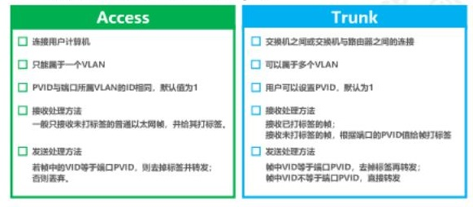

# 子网划分

## 子网地址的分配

**子网全部地址=子网的网络地址+广播地址+主机地址**

> 地址的所有主机位都为"0"时，这一地址为子网的网络地址，而当所有主机位都为"1"时为广播地址

## 常用子网掩码

| 掩码位数 |    子网掩码     | IP总数 |
| :------: | :-------------: | :----: |
|   /24    |  255.255.255.0  |  256   |
|   /25    | 255.255.255.128 |  128   |
|   /26    | 255.255.255.192 |   64   |
|   /27    | 255.255.255.224 |   32   |
|   /28    | 255.255.255.240 |   16   |
|   /29    | 255.255.255.248 |   8    |
|   /30    | 255.255.255.252 |   4    |

#  Cisco模式

Cisco IOS提供了用户模式和特权模式两种基本的命令执行级别，同时还提供了全局配置、接口配置、Line 配置等多种级别的配置模式，以允许用户对交换机的资源进行配置和管理。

## 1. 用户模式

> Router>

当用户通过交换机的控制台端口或 Telnet 会话连接并登录到交换机时，此时所处的命令执行模式就是用户模式。在该模式下，只执行有限的一组命令，这些命令通常用于查看显示系统信息、改变终端设置和执行一些最基本的测试命令，如 `ping` 、`traceroute ` 等。

## 2. 特权模式

> Router#

特权模式主要用于调试。在特权模式下，有检查、配置、调试等所有权限，除了特定端口的配置外，其他基本功能都可以在此模式下完成。在用户模式下，执行`enable` 命令，将进入到特权模式。在该模式下，用户能够执行 IOS 提供的所有命令。

> Router>enable
> Password:
> Router#

在前面的启动配置中，设置了登录特权模式的密码，因此系统提示输入用户密码，密码输入时不回显，输入完毕按回车，密码校验通过后，即进入特权模式。若进入特权模式的密码未设置或要修改，可在全局配置模式下，利用 `enable secret` 命令进行设置。

离开特权模式，返回用户模式，可执行 `exit` 或 `disable` 命令。

## 3. 全局配置模式

> Router(config)#

全局配置模式是用来配置的，此模式可以进一步的查看交换机的配置信息和调试信息，以及作出的配置作用于全局，该配置模式下配置的内容都将作用于全局。在特权模式下，执行 `configure terminal` 命令，即可进入全局配置模式。在该模式下，只要输入一条有效的配置命令并回车，内存中正在运行的配置就会立即改变生效。该模式下的配置命令的作用域是全局性的，是对整个交换机起作用。全局配置模式的命令状态行为：

> Router#config terminal
> Router(config)#

在全局配置模式，还可进入接口配置、line配置等子模式。

1. 从子模式返回全局配置模式，执行 exit命令；
2. 从全局配置模式返回特权模式，执行exit命令；
3. 若要退出任何配置模式，直接返回特权模式，则要直接 `end` 命令或按 Ctrl+Z 组合键。

对配置进行修改后， 为了使配置在下次掉电重启后仍生效，需要将新的配置保存到NVRAM中，其配置命令为：

> Router(config)#exit
> Router#write

## 4. 接口配置模式

> Router(config-if)#

在全局配置模式下，执行 `interface` 命令，即进入接口配置模式。在该模式下，可对选定的接口（端口） 进行配置， 并且只能执行配置交换机端口的命令。

## 5. Line 配置模式

> Router(config-line)#

在全局配置模式下，执行 `line vty` 或 `line console` 命令，将进入 Line 配置模式。该模式主要用于对虚拟终端（vty ）和控制台端口进行配置，其配置主要是设置虚拟终端和控制台的用户级登录密码。

交换机有一个控制端口（console），其编号为0，通常利用该端口进行本地登录，以实现对交换机的配置和管理。进入Line 配置模式方法为 ：

> student1(config)#line console 0 
> student1(config-line)# 

退出line配置模式，执行exit命令，若要退出任何配置模式，直接返回特权模式，则要直接 end 命令或按 Ctrl+Z组合键。

# VLAN 

