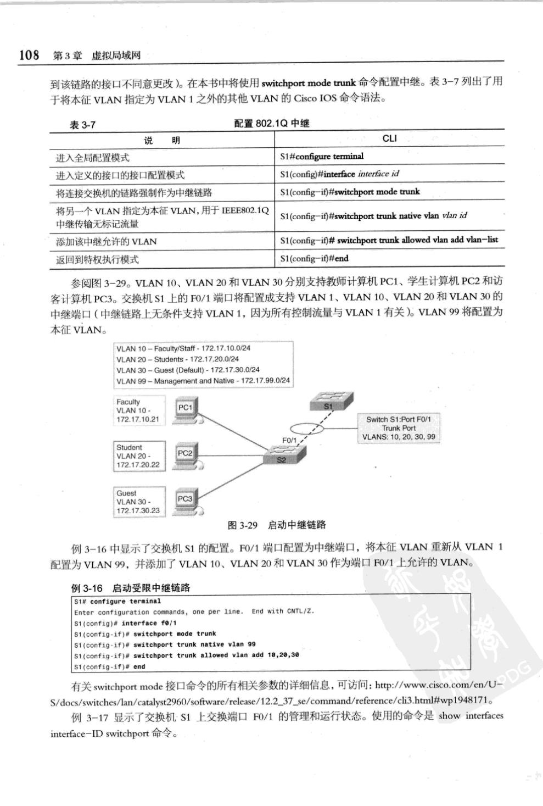
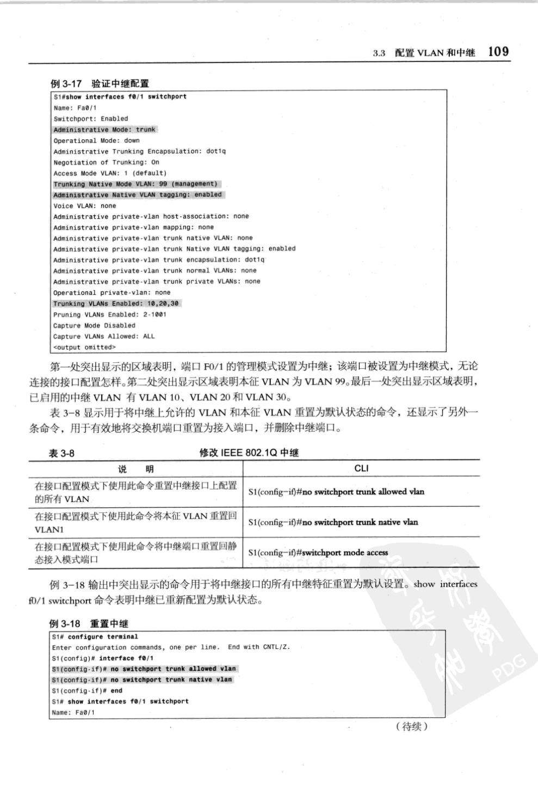
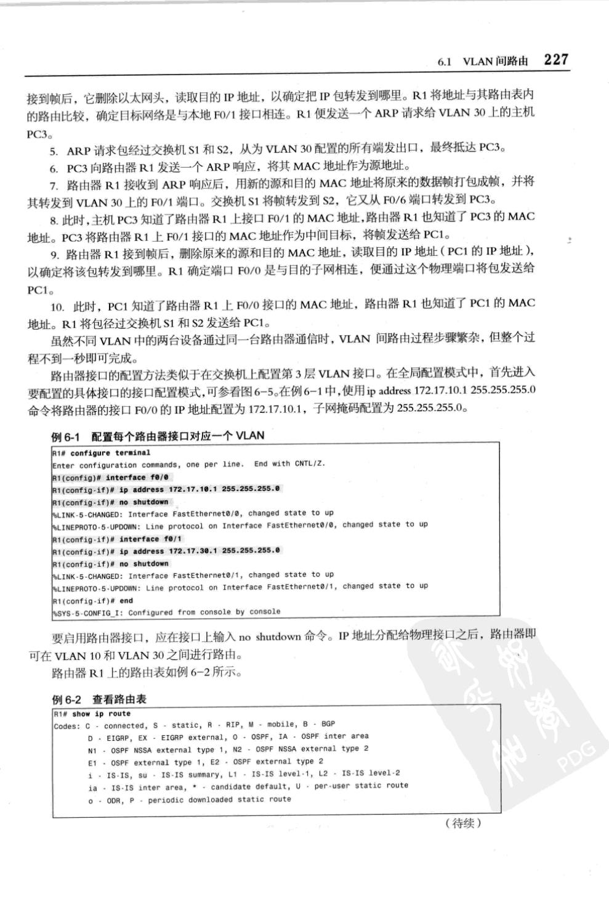
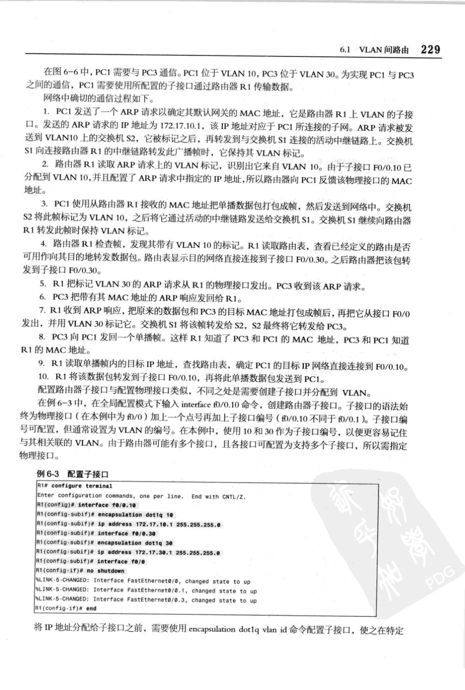
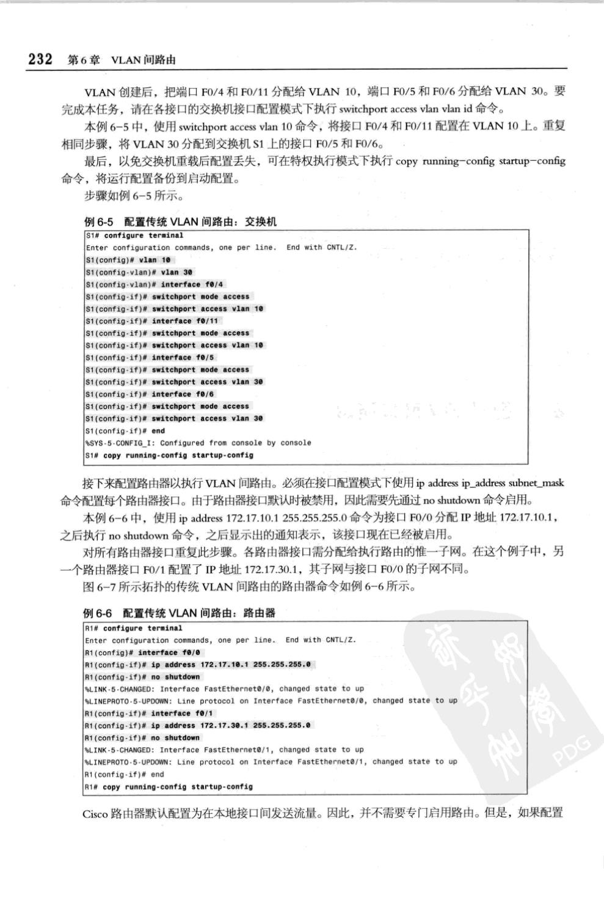
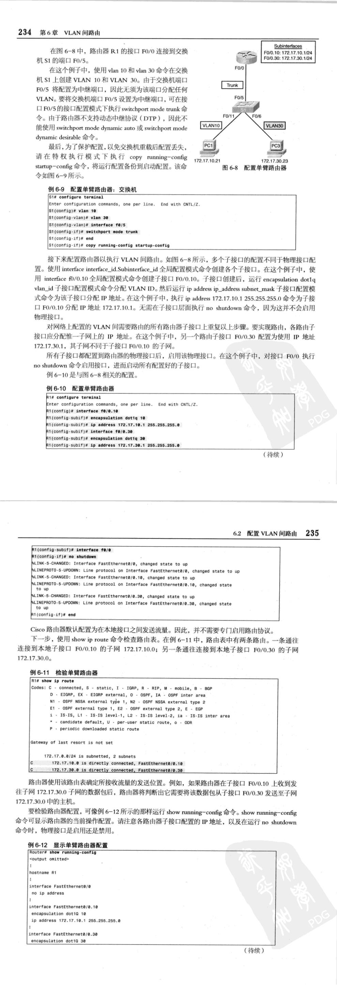

# 原理


# 配置 VLAN

## VLAN ID 范围

- 普通：1~1001
- 扩展：1006 ~ 4094

## 添加  VLAN

> | 说明                                                         | CLI                                |
> | ------------------------------------------------------------ | ---------------------------------- |
> | 进入全局配置模式                                             | Switch#configure terminal          |
> | 创建VLAN。VLAN ID是要创建的VLAN号<br>CLI 切换到 VLAN vlan id 的VLAN配置模式 | Switch(config)#vlan vlan-id        |
> | (可选）指定惟一的 VLAN 名称来标识 VLAN<br>如果没有输入名称，则默认为在“VLAN”后面添加多个零,<br>再加上 VLAN 号,例如 VLAN0020 | Switch(config-vlan)#name vlan-name |
> | 返回特权执行模式。读者必须结束配置会话，<br>使配置保存在 vlan.dat 文件中,并使配置生效 | Switch(config-vlan)#end            |

```
Switch#config t
Enter configuration commands, one per line.  End with CNTL/Z.
Switch(config)#vlan 100
Switch(config-vlan)#name student
Switch(config-vlan)#end
Switch#
```

## 查看

```
Switch#show vlan brief 
```

> ```
> Switch#config t
> Enter configuration commands, one per line.  End with CNTL/Z.
> Switch(config)#vlan 100
> Switch(config-vlan)#name student
> Switch(config-vlan)#end
> Switch#
> %SYS-5-CONFIG_I: Configured from console by console
> 
> Switch#show vlan brief 
> 
> VLAN Name                             Status    Ports
> 
> ---- -------------------------------- --------- -------------------------------
> 
> 1    default                          active    Fa0/1, Fa0/2, Fa0/3, Fa0/4
>                                                 Fa0/5, Fa0/6, Fa0/7, Fa0/8
>                                                 Fa0/9, Fa0/10, Fa0/11, Fa0/12
>                                                 Fa0/13, Fa0/14, Fa0/15, Fa0/16
>                                                 Fa0/17, Fa0/18, Fa0/19, Fa0/20
>                                                 Fa0/21, Fa0/22, Fa0/23, Fa0/24
>                                                 Gig0/1, Gig0/2
> 100  student                          active    
> 1002 fddi-default                     active    
> 1003 token-ring-default               active    
> 1004 fddinet-default                  active    
> 1005 trnet-default                    active    
> Switch#
> ```

## 静态 VLAN 端口设置

```
Switch(config)#interface f0/18
Switch(config-if)#switchport mode access
Switch(config-if)#switchport access vlan 20
Switch(config-if)#end
```

> ```
> Switch(config)#interface f0/18
> Switch(config-if)#switchport mode access
> Switch(config-if)#switchport access vlan 20
> % Access VLAN does not exist. Creating vlan 20
> Switch(config-if)#end
> Switch#
> %SYS-5-CONFIG_I: Configured from console by console
> 
> Switch#show vlan brief
> 
> VLAN Name                             Status    Ports
> 
> ---- -------------------------------- --------- -------------------------------
> 
> 1    default                          active    Fa0/1, Fa0/2, Fa0/3, Fa0/4
>                                              Fa0/5, Fa0/6, Fa0/7, Fa0/8
>                                              Fa0/9, Fa0/10, Fa0/11, Fa0/12
>                                              Fa0/13, Fa0/14, Fa0/15, Fa0/16
>                                              Fa0/17, Fa0/19, Fa0/20, Fa0/21
>                                              Fa0/22, Fa0/23, Fa0/24, Gig0/1
>                                              Gig0/2
> 20   VLAN0020                         active    Fa0/18
> 100  student                          active    
> 1002 fddi-default                     active    
> 1003 token-ring-default               active    
> 1004 fddinet-default                  active    
> 1005 trnet-default                    active    
> Switch#
> ```

# 管理 VLAN

## 查看 VLAN

> show vlan[brief|id **vlan-id**|name **vlan-name**|summary]
> 
> 


## 删除交换机端口上分配的VLAN

```
Switch(config)#int f0/18
Switch(config-if)#no switchport access vlan
Switch(config-if)#end
```

> ```
> Switch#show vlan brief 
> 
> VLAN Name                             Status    Ports
> ---- -------------------------------- --------- -------------------------------
> 1    default                          active    Fa0/1, Fa0/2, Fa0/3, Fa0/4
>                                                 Fa0/5, Fa0/6, Fa0/7, Fa0/8
>                                                 Fa0/9, Fa0/10, Fa0/11, Fa0/12
>                                                 Fa0/13, Fa0/14, Fa0/15, Fa0/16
>                                                 Fa0/17, Fa0/19, Fa0/20, Fa0/21
>                                                 Fa0/22, Fa0/23, Fa0/24, Gig0/1
>                                                 Gig0/2
> 20   VLAN0020                         active    Fa0/18
> 100  student                          active    
> 1002 fddi-default                     active    
> 1003 token-ring-default               active    
> 1004 fddinet-default                  active    
> 1005 trnet-default                    active    
> Switch#config t
> Enter configuration commands, one per line.  End with CNTL/Z.
> Switch(config)#
> Switch(config)#int f0/18
> Switch(config-if)#no switchport access vlan
> Switch(config-if)#end
> Switch#
> %SYS-5-CONFIG_I: Configured from console by console
> 
> Switch#show vlan brief 
> 
> VLAN Name                             Status    Ports
> ---- -------------------------------- --------- -------------------------------
> 1    default                          active    Fa0/1, Fa0/2, Fa0/3, Fa0/4
>                                                 Fa0/5, Fa0/6, Fa0/7, Fa0/8
>                                                 Fa0/9, Fa0/10, Fa0/11, Fa0/12
>                                                 Fa0/13, Fa0/14, Fa0/15, Fa0/16
>                                                 Fa0/17, Fa0/18, Fa0/19, Fa0/20
>                                                 Fa0/21, Fa0/22, Fa0/23, Fa0/24
>                                                 Gig0/1, Gig0/2
> 20   VLAN0020                         active    
> 100  student                          active    
> 1002 fddi-default                     active    
> 1003 token-ring-default               active    
> 1004 fddinet-default                  active    
> 1005 trnet-default                    active    
> Switch#
> ```

## 删除 VLAN 

> Switch(config)#no vlan 20
>

> ```
> Switch(config)#no vlan 20
> Switch(config)#end
> Switch#
> %SYS-5-CONFIG_I: Configured from console by console
> 
> Switch#show vlan brief 
> 
> VLAN Name                             Status    Ports
> ---- -------------------------------- --------- -------------------------------
> 1    default                          active    Fa0/1, Fa0/2, Fa0/3, Fa0/4
>                                                 Fa0/5, Fa0/6, Fa0/7, Fa0/8
>                                                 Fa0/9, Fa0/10, Fa0/11, Fa0/12
>                                                 Fa0/13, Fa0/14, Fa0/15, Fa0/16
>                                                 Fa0/17, Fa0/18, Fa0/19, Fa0/20
>                                                 Fa0/21, Fa0/22, Fa0/23, Fa0/24
>                                                 Gig0/1, Gig0/2
> 100  student                          active    
> 1002 fddi-default                     active    
> 1003 token-ring-default               active    
> 1004 fddinet-default                  active    
> 1005 trnet-default                    active    
> Switch#
> ```
>


# 中继

## 配置



## 修改



## 查看

> Switch#show interfaces trunk 


# VLAN间路由

## 传统



## 单臂路由


### 配置子接口




#### 查看

```
show ip route
```

## 传统路由



### 查看

```
show ip route
```

```
show run
```

## 单臂路由




