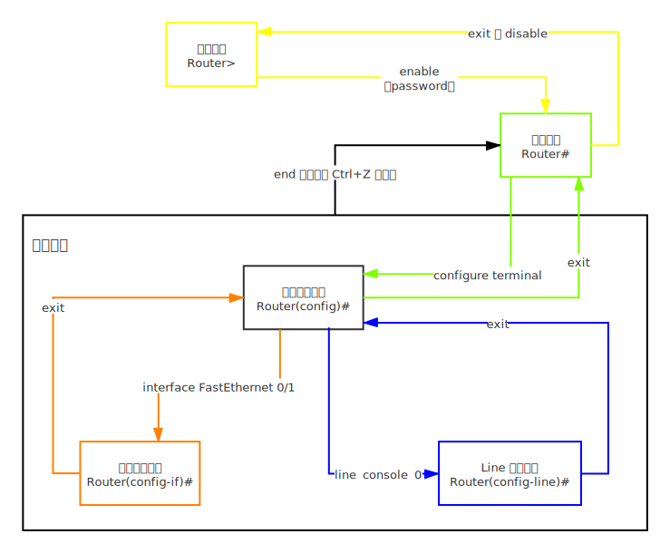

### Cisco模式间的转换



### show

#### show ip interface brief

##### 命令

> Router#show ip interface brief

##### 样例

> 显示简单地接口信息：
>
> ```
> Router#show ip interface brief 
> Interface              IP-Address      OK? Method Status                Protocol 
> FastEthernet0/0        unassigned      YES unset  administratively down down 
> FastEthernet0/1        unassigned      YES unset  administratively down down 
> Vlan1                  unassigned      YES unset  administratively down down
> Router#
> ```

#### show interfaces **interface-id**

##### 命令

> Router#show interfaces  **interface-id** 

- **interface-id**：可选项，如果没有，则表示显示全部接口信息，如果有，则表示显示 **interface-id** 指定的接口信息

##### 样例
> - 显示全部接口信息
> - 显示 `FastEthernet 0/0`  接口信息 
>
> ```
> Router#show interfaces 
> FastEthernet0/0 is administratively down, line protocol is down (disabled)
> Hardware is Lance, address is 0030.a346.4801 (bia 0030.a346.4801)
> MTU 1500 bytes, BW 100000 Kbit, DLY 100 usec,
>   reliability 255/255, txload 1/255, rxload 1/255
> Encapsulation ARPA, loopback not set
> Full-duplex, 100Mb/s, media type is RJ45
> ARP type: ARPA, ARP Timeout 04:00:00, 
> Last input 00:00:08, output 00:00:05, output hang never
> Last clearing of "show interface" counters never
> Input queue: 0/75/0 (size/max/drops); Total output drops: 0
> Queueing strategy: fifo
> Output queue :0/40 (size/max)
> 5 minute input rate 0 bits/sec, 0 packets/sec
> 5 minute output rate 0 bits/sec, 0 packets/sec
>   0 packets input, 0 bytes, 0 no buffer
>   Received 0 broadcasts, 0 runts, 0 giants, 0 throttles
>   0 input errors, 0 CRC, 0 frame, 0 overrun, 0 ignored, 0 abort
>   0 input packets with dribble condition detected
>   0 packets output, 0 bytes, 0 underruns
>   0 output errors, 0 collisions, 1 interface resets
>   0 babbles, 0 late collision, 0 deferred
>   0 lost carrier, 0 no carrier
>   0 output buffer failures, 0 output buffers swapped out
> FastEthernet0/1 is administratively down, line protocol is down (disabled)
> Hardware is Lance, address is 0030.a346.4802 (bia 0030.a346.4802)
> MTU 1500 bytes, BW 100000 Kbit, DLY 100 usec,
>   reliability 255/255, txload 1/255, rxload 1/255
> Encapsulation ARPA, loopback not set
> Full-duplex, 100Mb/s, media type is RJ45
> ARP type: ARPA, ARP Timeout 04:00:00, 
> Last input 00:00:08, output 00:00:05, output hang never
> Last clearing of "show interface" counters never
> Input queue: 0/75/0 (size/max/drops); Total output drops: 0
> Queueing strategy: fifo
> Output queue :0/40 (size/max)
> 5 minute input rate 0 bits/sec, 0 packets/sec
> 5 minute output rate 0 bits/sec, 0 packets/sec
>   0 packets input, 0 bytes, 0 no buffer
>   Received 0 broadcasts, 0 runts, 0 giants, 0 throttles
>   0 input errors, 0 CRC, 0 frame, 0 overrun, 0 ignored, 0 abort
>   0 input packets with dribble condition detected
>   0 packets output, 0 bytes, 0 underruns
>   0 output errors, 0 collisions, 1 interface resets
>   0 babbles, 0 late collision, 0 deferred
>   0 lost carrier, 0 no carrier
>   0 output buffer failures, 0 output buffers swapped out
> Vlan1 is administratively down, line protocol is down
> Hardware is CPU Interface, address is 00e0.f955.67d5 (bia 00e0.f955.67d5)
> MTU 1500 bytes, BW 100000 Kbit, DLY 1000000 usec,
>   reliability 255/255, txload 1/255, rxload 1/255
> Encapsulation ARPA, loopback not set
> ARP type: ARPA, ARP Timeout 04:00:00
> Last input 21:40:21, output never, output hang never
> Last clearing of "show interface" counters never
> Input queue: 0/75/0/0 (size/max/drops/flushes); Total output drops: 0
> Queueing strategy: fifo
> Output queue: 0/40 (size/max)
> 5 minute input rate 0 bits/sec, 0 packets/sec
> 5 minute output rate 0 bits/sec, 0 packets/sec
>   1682 packets input, 530955 bytes, 0 no buffer
>   Received 0 broadcasts (0 IP multicast)
>   0 runts, 0 giants, 0 throttles
>   0 input errors, 0 CRC, 0 frame, 0 overrun, 0 ignored
>   563859 packets output, 0 bytes, 0 underruns
>   0 output errors, 23 interface resets
>   0 output buffer failures, 0 output buffers swapped out
> 
> Router#
> ```
> 
> ```
> Router#show interfaces FastEthernet 0/0
> FastEthernet0/0 is administratively down, line protocol is down (disabled)
> Hardware is Lance, address is 0030.a346.4801 (bia 0030.a346.4801)
> MTU 1500 bytes, BW 100000 Kbit, DLY 100 usec,
>   reliability 255/255, txload 1/255, rxload 1/255
> Encapsulation ARPA, loopback not set
> Full-duplex, 100Mb/s, media type is RJ45
> ARP type: ARPA, ARP Timeout 04:00:00, 
> Last input 00:00:08, output 00:00:05, output hang never
> Last clearing of "show interface" counters never
> Input queue: 0/75/0 (size/max/drops); Total output drops: 0
> Queueing strategy: fifo
> Output queue :0/40 (size/max)
> 5 minute input rate 0 bits/sec, 0 packets/sec
> 5 minute output rate 0 bits/sec, 0 packets/sec
>   0 packets input, 0 bytes, 0 no buffer
>   Received 0 broadcasts, 0 runts, 0 giants, 0 throttles
>   0 input errors, 0 CRC, 0 frame, 0 overrun, 0 ignored, 0 abort
>   0 input packets with dribble condition detected
>   0 packets output, 0 bytes, 0 underruns
>   0 output errors, 0 collisions, 1 interface resets
>   0 babbles, 0 late collision, 0 deferred
>   0 lost carrier, 0 no carrier
>   0 output buffer failures, 0 output buffers swapped out
> 
> Router#
> ```
>

#### show ip route

##### 命令

> Router#show ip route

##### 样例

> 查看路由表：
>
> ```
> Router#show ip route
> Codes: C - connected, S - static, I - IGRP, R - RIP, M - mobile, B - BGP
>     D - EIGRP, EX - EIGRP external, O - OSPF, IA - OSPF inter area
>     N1 - OSPF NSSA external type 1, N2 - OSPF NSSA external type 2
>     E1 - OSPF external type 1, E2 - OSPF external type 2, E - EGP
>     i - IS-IS, L1 - IS-IS level-1, L2 - IS-IS level-2, ia - IS-IS inter area
>        * - candidate default, U - per-user static route, o - ODR
>        P - periodic downloaded static route
> 
> Gateway of last resort is not set
> 
> 
> Router#
> ```

#### show running-config 

##### 命令

> Router#show running-config 

##### 样例

> 显示存储在内存中的当前运行配置：
>
> ```
> Router#show running-config 
> Building configuration...
> 
> Current configuration : 553 bytes
> !
> version 12.4
> no service timestamps log datetime msec
> no service timestamps debug datetime msec
> no service password-encryption
> !
> hostname Router
> !
> !
> !
> !
> !
> !
> !
> !
> ip cef
> no ipv6 cef
> !
> !
> !
> !
> !
> !
> !
> !
> !
> !
> !
> !
> spanning-tree mode pvst
> !
> !
> !
> !
> !
> !
> interface FastEthernet0/0
> no ip address
> duplex auto
> speed auto
> shutdown
> !
> interface FastEthernet0/1
> no ip address
> duplex auto
> speed auto
> shutdown
> !
> interface Vlan1
> no ip address
> shutdown
> !
> ip classless
> !
> ip flow-export version 9
> !
> !
> !
> !
> !
> !
> !
> !
> line con 0
> !
> line aux 0
> !
> line vty 0 4
> login
> !
> !
> !
> end
> 
> 
> Router#
> ```

#### show startup-config 

##### 命令

> Router#show startup-config 

##### 样例

> ```
> Router#show startup-config 
> startup-config is not present
> ```

### 保存

#### copy running-config startup-config

##### 命令

> Router#copy running-config startup-config

将 `running-config` 保存到 `startup-config` 作为永久性配置文件，下次开机自动加载，可使用 `show startup-config ` 查看是否保存成功。

##### 样例

> ```
> Router#show startup-config 
> startup-config is not present
> Router#copy running-config startup-config 
> Destination filename [startup-config]? 
> Building configuration...
> [OK]
> Router#show startup-config 
> Using 553 bytes
> !
> version 12.4
> no service timestamps log datetime msec
> no service timestamps debug datetime msec
> no service password-encryption
> !
> hostname Router
> !
> !
> !
> !
> !
> !
> !
> !
> ip cef
> no ipv6 cef
> !
> !
> !
> !
> !
> !
> !
> !
> !
> !
> !
> !
> spanning-tree mode pvst
> !
> !
> !
> !
> !
> !
> interface FastEthernet0/0
>  no ip address
>  duplex auto
>  speed auto
>  shutdown
> !
> interface FastEthernet0/1
>  no ip address
>  duplex auto
>  speed auto
>  shutdown
> !
> interface Vlan1
>  no ip address
>  shutdown
> !
> ip classless
> !
> ip flow-export version 9
> !
> !
> !
> !
> !
> !
> !
> !
> line con 0
> !
> line aux 0
> !
> line vty 0 4
>  login
> !
> !
> !
> end
> 
> 
> Router#
> ```

#### erase startup-config

##### 命令

> Router#erase startup-config 

##### 样例

> 清除路由器上的配置
>
> ```
> Router#show startup-config 
> Using 553 bytes
> !
> version 12.4
> ... ...
> end
> 
> 
> Router#
> Router#erase startup-config 
> Erasing the nvram filesystem will remove all configuration files! Continue? [confirm]
> [OK]
> Erase of nvram: complete
> %SYS-7-NV_BLOCK_INIT: Initialized the geometry of nvram
> Router#show startup-config 
> startup-config is not present
> Router#
> ```

#### reload

##### 命令

> Router#reload

##### 样例

> 重启：
>
> ```
> Router#reload
> Proceed with reload? [confirm]
> System Bootstrap, Version 12.3(8r)T8, RELEASE SOFTWARE (fc1)
> Initializing memory for ECC
> ..
> C1841 processor with 524288 Kbytes of main memory
> Main memory is configured to 64 bit mode with ECC enabled
> 
> Readonly ROMMON initialized
> 
> Self decompressing the image :
> ########################################################################## [OK]
>               Restricted Rights Legend
> 
> Use, duplication, or disclosure by the Government is
> subject to restrictions as set forth in subparagraph
> (c) of the Commercial Computer Software - Restricted
> Rights clause at FAR sec. 52.227-19 and subparagraph
> (c) (1) (ii) of the Rights in Technical Data and Computer
> Software clause at DFARS sec. 252.227-7013.
> 
>            cisco Systems, Inc.
>            170 West Tasman Drive
>            San Jose, California 95134-1706
> 
> 
> 
> Cisco IOS Software, 1841 Software (C1841-ADVIPSERVICESK9-M), Version 12.4(15)T1, RELEASE SOFTWARE (fc2)
> Technical Support: http://www.cisco.com/techsupport
> Copyright (c) 1986-2007 by Cisco Systems, Inc.
> Compiled Wed 18-Jul-07 04:52 by pt_team
> Image text-base: 0x60080608, data-base: 0x6270CD50
> 
> 
> This product contains cryptographic features and is subject to United
> States and local country laws governing import, export, transfer and
> use. Delivery of Cisco cryptographic products does not imply
> third-party authority to import, export, distribute or use encryption.
> Importers, exporters, distributors and users are responsible for
> compliance with U.S. and local country laws. By using this product you
> agree to comply with applicable laws and regulations. If you are unable
> to comply with U.S. and local laws, return this product immediately.
> 
> A summary of U.S. laws governing Cisco cryptographic products may be found at:
> http://www.cisco.com/wwl/export/crypto/tool/stqrg.html
> 
> If you require further assistance please contact us by sending email to
> export@cisco.com.
> 
> 
> Cisco 1841 (revision 5.0) with 114688K/16384K bytes of memory.
> Processor board ID FTX0947Z18E
> M860 processor: part number 0, mask 49
> 2 FastEthernet/IEEE 802.3 interface(s)
> 191K bytes of NVRAM.
> 63488K bytes of ATA CompactFlash (Read/Write)
> Cisco IOS Software, 1841 Software (C1841-ADVIPSERVICESK9-M), Version 12.4(15)T1, RELEASE SOFTWARE (fc2)
> Technical Support: http://www.cisco.com/techsupport
> Copyright (c) 1986-2007 by Cisco Systems, Inc.
> Compiled Wed 18-Jul-07 04:52 by pt_team
> 
> 
>          --- System Configuration Dialog ---
> 
> Would you like to enter the initial configuration dialog? [yes/no]: no
> 
> 
> Press RETURN to get started!
> 
> 
> 
> Router>
> ```

### 基本配置

#### hostname **name**

> hostname **name**

- **name**：给主机配置的名字

> 将主机名设置为 `R1`
>
> ```
> Router(config)#hostname R1
> R1(config)#
> ```

#### no ip domain-lookup

> 禁用 DNS 查找：
>
> ```
> Router(config)#no ip domain-lookup 
> Router(config)#end
> Router#
> %SYS-5-CONFIG_I: Configured from console by console
> 
> Router#end
> Translating "end"
> % Unknown command or computer name, or unable to find computer address
> 
> Router#
> ```

#### enable secret **password**

- **password**：需要配置的密码

配置特权模式口令:


> 配置密码为 `pwd`：
>
> ```
> Router(config)#enable secret pwd
> Router(config)#end
> Router#
> %SYS-5-CONFIG_I: Configured from console by console
> 
> Router#exit
> ... ...
> Router>
> Router>enable 
> Password: 
> Router#
> ```
>
> 

#### banner motd # **massage** #

注意：消息开头结尾要使用定界符 `#` ，定界符可用于配置多行标语。

> 配置标语为 ：
>
> ```
> massage
> br
> ```
>
> 先进入配置 `banner motd #`，再输入配置内容：
>
> ```
> massage
> br#
> ```
>
> 注意以定界符 `#` 结尾
>
> ```
> Router(config)#banner motd #
> Enter TEXT message.  End with the character '#'.
> massage
> br#
> 
> Router(config)#exit
> Router#
> %SYS-5-CONFIG_I: Configured from console by console
> 
> Router#show running-config 
> ... ...
> banner motd ^C
> massage
> br^C
> ... ...
> end
> 
> 
> Router#
> ```

#### no shutdown 

> ```
> Router#show ip interface brief 
> Interface              IP-Address      OK? Method Status                Protocol 
> FastEthernet0/0        unassigned      YES unset  administratively down down 
> FastEthernet0/1        192.168.64.1    YES manual administratively down down 
> Vlan1                  unassigned      YES unset  administratively down down
> Router#configure terminal 
> Enter configuration commands, one per line.  End with CNTL/Z.
> Router(config)#
> Router(config)#interface FastEthernet 0/1
> Router(config-if)#no shutdown 
> 
> Router(config-if)#
> %LINK-5-CHANGED: Interface FastEthernet0/1, changed state to up
> 
> Router(config-if)#end
> Router#
> %SYS-5-CONFIG_I: Configured from console by console
> 
> Router#show ip interface brief 
> Interface              IP-Address      OK? Method Status                Protocol 
> FastEthernet0/0        unassigned      YES unset  administratively down down 
> FastEthernet0/1        192.168.64.1    YES manual up                    down 
> Vlan1                  unassigned      YES unset  administratively down down
> Router#
> ```
>
> 

#### ip address **ip-address** **mask**

> ```
> Router(config)#interface FastEthernet 0/1
> Router(config-if)#ip address 192.168.64.1 255.255.255.0
> Router(config-if)#end
> Router#
> %SYS-5-CONFIG_I: Configured from console by console
> 
> Router#show interfaces FastEthernet 0/1
> ... ...
>   Internet address is 192.168.64.1/24
> ... ...
> Router#
> ```
>
> 

#### clock rate **clock-rate**

连接上电缆后，即可使用 clock rate 命令来设置时钟。可用的时钟频率(bit/s)包括1200、2400、9600、19 200、38 400、56 000、64 000、72 000、125 000、148 000、500 000、800 000、1 000 000、1300 000、2 000 000 以及 4 000 000。其中，有些比特率在某些串行接口上不受支持。
R1(config)# interface serial 0/0
R1 (config-if)# clock rate 64000

配置 Serial0/0/0 接口:	

```
interface serial 0/0/0
ip address (sddress) (subnet mask)
clock rate 64000
no shutdown
```

> ```
> Router#show running-config 
> ... ...
> interface Serial0/0/0
>  no ip address
>  clock rate 2000000
>  shutdown
> ... ...
> end
> 
> 
> Router#
> Router#configure terminal 
> Enter configuration commands, one per line.  End with CNTL/Z.
> Router(config)#interface Serial 0/0/0
> Router(config-if)#clock rate 64000
> Router(config-if)#end
> Router#
> %SYS-5-CONFIG_I: Configured from console by console
> 
> Router#show running-config 
> ... ...
> interface Serial0/0/0
>  no ip address
>  clock rate 64000
>  shutdown
> ... ...
> end
> 
> 
> Router#
> ```

#### line console 0

> 配置  [VTY](https://baike.baidu.com/item/%E8%99%9A%E6%8B%9F%E7%BB%88%E7%AB%AF/11044784?fromtitle=vty&fromid=6895751&fr=aladdin) 控制台 密码为 `pwd`：
>
> ```
> Router(config)#line console 0
> Router(config-line)#password pwd
> Router(config-line)#login 
> ```
>
> 使用 PC0 进行远程登录：
>
> 
>
> PC0 Terminal 登录可见：
>
> ```
> ... ...
> User Access Verification
> 
> Password: 
> 
> Router>
> ```

#### line vty 0 4

为虚拟终端线路配置口令:	

> ```
> Router(config)#line vty 0 4
> Router(config-line)#password pwd
> Router(config-line)#login
> ```

#### logging synchronous

我们在Console 输入命令的时候，如果有日志输出那么会在你输入的行里显示影响你接下来命令的输入。

我们使用 logging synchronous 这个命令可以隔离日志，使你的命令输入不受其影响。

```
line console 0
logging synchronous
line vty 0 4
logging synchronous
```

> ```
> Router#show running-config 
> ... ...
> line con 0
> !
> ... ...
> end
> 
> 
> 
> Router#configure terminal 
> Enter configuration commands, one per line.  End with CNTL/Z.
> Router(config)#line console 0
> Router(config-line)#logging synchronous 
> Router(config-line)#end
> Router#
> %SYS-5-CONFIG_I: Configured from console by console
> 
> Router#show running-config 
> ... ...
> line con 0
>  logging synchronous
> !
> ... ...
> end
> 
> 
> Router#
> ```
>
> ```
> Router#show running-config 
> ... ...
> line vty 0 4
>  login
> !
> ... ...
> end
> 
> 
> Router#
> Router#configure terminal 
> Enter configuration commands, one per line.  End with CNTL/Z.
> Router(config)#line vty 0 4
> Router(config-line)#logging synchronous 
> Router(config-line)#end
> Router#
> %SYS-5-CONFIG_I: Configured from console by console
> 
> Router#show running-config 
> ... ...
> line vty 0 4
>  logging synchronous
>  login
> !
> ... ...
> end
> 
> 
> Router#
> ```
>
> 

#### exec-timeout **minute** **second**

> 将控制台baiEXEC 会话的超时du时间,Todd（config-line)#exec-timeout 0 0这样设置永不超时，默认zhi是10分钟。就是说，系统无操dao作 登陆密码zhuan10分钟后退出。 0 0，前面是设置的分钟，后面是秒。比如想设置10分30秒的话就是Todd（config-line)#exec-timeout 10 30. 


在路由器的控制台和虚拟终端线路上添加exec-timeout命令,设置为10分30秒、永不超时

```
line console 0
exec-timeout 0 0
line vty 0 4
exec-timeout 0 0
```

> ```
> Router#show running-config 
> ... ...
> line con 0
> !
> ... ...
> end
> 
> 
> Router#configure terminal 
> Enter configuration commands, one per line.  End with CNTL/Z.
> Router(config)#line console 0
> Router(config-line)#exec-timeout 10 30
> Router(config-line)#end
> Router#
> %SYS-5-CONFIG_I: Configured from console by console
> 
> Router#SHow running-config 
> ... ...
> line con 0
>  exec-timeout 10 30
> !
> ... ...
> end
> 
> 
> Router#
> Router#
> ```
>
> 
>
> ```
> Router#show running-config 
> ... ...
> line vty 0 4
>  login
> !
> ... ...
> end
> 
> 
> Router#
> Router#configure terminal 
> Enter configuration commands, one per line.  End with CNTL/Z.
> Router(config)#line vty 0
> Router(config-line)#exec-timeout 0 0
> Router(config-line)#end
> Router#
> %SYS-5-CONFIG_I: Configured from console by console
> 
> Router#show running-config
> ... ...
> line vty 0 4
>  exec-timeout 0 0
>  login
> !
> ... ...
> end
> 
> 
> Router#
> ```
>
> 
>
> 
>

### route

#### debug ip routing 

观察路由如何添加到路由表中

```
Router#debug ip routing 
```

#### undebug ip routing 

解除观察路由如何添加到路由表中

```
Router#undebug ip routing 
```

#### ip route netwok-address subnet-mask {**ip-address** | **exit-interface**}

##### 配置

> Router(config)#ip route netwok-address subnet-mask {ip-address | exit-interface}

配置静态路由：目的网络网络 `192.168.64.0` ，子网掩码为 `255.255.255.0` ，下一跳地址 `192.168.65.1`

```
Router(config)#ip route 192.168.64.0 255.255.255.0 192.168.65.1
```

配置静态路由：目的网络网络 `192.168.64.0` ，子网掩码为 `255.255.255.0` ，从本机接口 `Serial0/0/0` 发出

```
Router(config)#ip route 192.168.64.0 255.255.255.0 serial 0/0/0
```

#### no ip route netwok-address subnet-mask {**ip-address** | **exit-interface**}

> Router(config)#no ip route netwok-address subnet-mask {ip-address | exit-interface}

#### ip route 0.0.0.0 0.0.0.0 {**ip-address** | **exit-interface**}

默认静态路由

> Router(config)#ip route 0.0.0.0 0.0.0.0 {ip-address | exit-interface}

为接口 `fastEthernet 0/0`  配置静态路由

```
Router(config)#ip route 0.0.0.0 0.0.0.0 fastEthernet 0/0
```

### OSPF

#### route ospf **process-id**

启用

> Router(config)#route ospf process-id

```
Router(config)#route ospf 1
Router(config-router)#
```

#### network **network-address** **wildcard-mask** area **area-id**

> Router(config-router)#network network-address wildcard-mask area area-id

```
Router(config-router)#network 192.168.64.0 0.0.0.255 area 0
```

#### show ip protocols 

查看路由器 ID

```
Router#show ip protocols 
```

#### interface loopback **number**

> Router(config)#interface loopback **number**
> Router(config-if)#ip address **ip-address** **subnet-mask**

```
Router(config)#interface loopback 0
Router(config-if)#ip address 192.168.64.1 255.255.255.255
```

#### router-id **ip-address**

> Router(config)#router ospf process-id
> Router(config-router)#router-id ip-address

```
Router(config)#router ospf 1
Router(config-router)#router-id 192.168.64.1
```

#### show ip ospf neighbor

```
Router#show ip ospf neighbor
```

#### show ip ospf

```
Router#show ip ospf
```


#### show ip ospf interface  **interface-id**

```
Router#show ip ospf interface serial 0/0/0
```

#### bandwidth **bandwidth-kbps**

配置带宽为 **64kbps**

> Router(config-if)#bandwidth **bandwidth-kbps**

```
Router(config-if)#bandwidth 64
```

开销值=10<sup>8</sup>/bandwidth-kbps

上面这条配置的开销值=10<sup>8</sup>/64kbps=1562

#### ip ospf cost **path-cost**

```
Router(config-if)#ip ospf cost 1562
```

#### ip ospf priority **{0 - 255}**

> Router(config-if)#ip ospf priority {0 - 255}

```
Router(config-if)#ip ospf priority 100
```

### VLAN

#### vlan **vlan-id**

#### name **vlan-name**

VLAN ID 范围

- 普通：1~1001
- 扩展：1006 ~ 4094

添加  VLAN

> | 说明                                                         | CLI                                |
> | ------------------------------------------------------------ | ---------------------------------- |
> | 进入全局配置模式                                             | Switch#configure terminal          |
> | 创建VLAN。VLAN ID是要创建的VLAN号<br>CLI 切换到 VLAN vlan id 的VLAN配置模式 | Switch(config)#vlan vlan-id        |
> | (可选）指定惟一的 VLAN 名称来标识 VLAN<br>如果没有输入名称，则默认为在“VLAN”后面添加多个零,再加上 VLAN 号,例如 VLAN0020 | Switch(config-vlan)#name vlan-name |
> | 返回特权执行模式。读者必须结束配置会话，<br>使配置保存在 vlan.dat 文件中,并使配置生效 | Switch(config-vlan)#end            |

```
Switch#config t
Enter configuration commands, one per line.  End with CNTL/Z.
Switch(config)#vlan 100
Switch(config-vlan)#name student
Switch(config-vlan)#end
Switch#
```

#### show vlan brief 

```
Switch#show vlan brief 
```

> ```
> Switch#config t
> Enter configuration commands, one per line.  End with CNTL/Z.
> Switch(config)#vlan 100
> Switch(config-vlan)#name student
> Switch(config-vlan)#end
> Switch#
> %SYS-5-CONFIG_I: Configured from console by console
> 
> Switch#show vlan brief 
> 
> VLAN Name                             Status    Ports
> 
> ---- -------------------------------- --------- -------------------------------
> 
> 1    default                          active    Fa0/1, Fa0/2, Fa0/3, Fa0/4
>                                              Fa0/5, Fa0/6, Fa0/7, Fa0/8
>                                              Fa0/9, Fa0/10, Fa0/11, Fa0/12
>                                              Fa0/13, Fa0/14, Fa0/15, Fa0/16
>                                              Fa0/17, Fa0/18, Fa0/19, Fa0/20
>                                              Fa0/21, Fa0/22, Fa0/23, Fa0/24
>                                              Gig0/1, Gig0/2
> 100  student                          active    
> 1002 fddi-default                     active    
> 1003 token-ring-default               active    
> 1004 fddinet-default                  active    
> 1005 trnet-default                    active    
> Switch#
> ```

#### switchport mode access

#### switchport access vlan **vlan-id**

```
Switch(config)#interface f0/18
Switch(config-if)#switchport mode access
Switch(config-if)#switchport access vlan 20
Switch(config-if)#end
```

> ```
> Switch(config)#interface f0/18
> Switch(config-if)#switchport mode access
> Switch(config-if)#switchport access vlan 20
> % Access VLAN does not exist. Creating vlan 20
> Switch(config-if)#end
> Switch#
> %SYS-5-CONFIG_I: Configured from console by console
> 
> Switch#show vlan brief
> 
> VLAN Name                             Status    Ports
> 
> ---- -------------------------------- --------- -------------------------------
> 
> 1    default                          active    Fa0/1, Fa0/2, Fa0/3, Fa0/4
>                                           Fa0/5, Fa0/6, Fa0/7, Fa0/8
>                                           Fa0/9, Fa0/10, Fa0/11, Fa0/12
>                                           Fa0/13, Fa0/14, Fa0/15, Fa0/16
>                                           Fa0/17, Fa0/19, Fa0/20, Fa0/21
>                                           Fa0/22, Fa0/23, Fa0/24, Gig0/1
>                                           Gig0/2
> 20   VLAN0020                         active    Fa0/18
> 100  student                          active    
> 1002 fddi-default                     active    
> 1003 token-ring-default               active    
> 1004 fddinet-default                  active    
> 1005 trnet-default                    active    
> Switch#
> ```


#### show vlan[brief|id **vlan-id**|name **vlan-name**|summary]

| 解释                                                         | 语法           |
| ------------------------------------------------------------ | -------------- |
| 每行显示一个VLAN的VLAN 名称、状态和端口                      | brief          |
| 显示由 VLAN ID 号标识的单个VLAN的相关信息<br/>vlan-id 的范围是1~4094 | **id** vlan-id |
| 显示由VLAN 名称标识的单个VLAN的相关信息。VLAN名称是<br/>介于1~32个字符之间的ASCII字符串 | Name vlan-name |
| 显示VLAN摘要信息                                             | summary        |

#### show interfaces [interface-id| vlan vlan-id] | switchport

| 解释                                                         | 语法         |
| ------------------------------------------------------------ | ------------ |
| 有效的接口包括物理端口(包括类型、模块和端口号）和端口通法道。端口通道的范围是1~6 | interface-id |
| VLAN标识。范围是1~4094                                       | vlan vlan-id |
| 显示交换机端口的管理状态和运行状态,包括端口阻塞设置和端口保护设置 | switchport   |


#### no switchport access vlan

```
Switch(config)#int f0/18
Switch(config-if)#no switchport access vlan
Switch(config-if)#end
```

> ```
> Switch#show vlan brief 
> 
> VLAN Name                             Status    Ports
> ---- -------------------------------- --------- -------------------------------
> 1    default                          active    Fa0/1, Fa0/2, Fa0/3, Fa0/4
>                                              Fa0/5, Fa0/6, Fa0/7, Fa0/8
>                                              Fa0/9, Fa0/10, Fa0/11, Fa0/12
>                                              Fa0/13, Fa0/14, Fa0/15, Fa0/16
>                                              Fa0/17, Fa0/19, Fa0/20, Fa0/21
>                                              Fa0/22, Fa0/23, Fa0/24, Gig0/1
>                                              Gig0/2
> 20   VLAN0020                         active    Fa0/18
> 100  student                          active    
> 1002 fddi-default                     active    
> 1003 token-ring-default               active    
> 1004 fddinet-default                  active    
> 1005 trnet-default                    active    
> Switch#config t
> Enter configuration commands, one per line.  End with CNTL/Z.
> Switch(config)#
> Switch(config)#int f0/18
> Switch(config-if)#no switchport access vlan
> Switch(config-if)#end
> Switch#
> %SYS-5-CONFIG_I: Configured from console by console
> 
> Switch#show vlan brief 
> 
> VLAN Name                             Status    Ports
> ---- -------------------------------- --------- -------------------------------
> 1    default                          active    Fa0/1, Fa0/2, Fa0/3, Fa0/4
>                                              Fa0/5, Fa0/6, Fa0/7, Fa0/8
>                                              Fa0/9, Fa0/10, Fa0/11, Fa0/12
>                                              Fa0/13, Fa0/14, Fa0/15, Fa0/16
>                                              Fa0/17, Fa0/18, Fa0/19, Fa0/20
>                                              Fa0/21, Fa0/22, Fa0/23, Fa0/24
>                                              Gig0/1, Gig0/2
> 20   VLAN0020                         active    
> 100  student                          active    
> 1002 fddi-default                     active    
> 1003 token-ring-default               active    
> 1004 fddinet-default                  active    
> 1005 trnet-default                    active    
> Switch#
> ```

#### no vlan 20

> Switch(config)#no vlan 20

> ```
> Switch(config)#no vlan 20
> Switch(config)#end
> Switch#
> %SYS-5-CONFIG_I: Configured from console by console
> 
> Switch#show vlan brief 
> 
> VLAN Name                             Status    Ports
> ---- -------------------------------- --------- -------------------------------
> 1    default                          active    Fa0/1, Fa0/2, Fa0/3, Fa0/4
>                                              Fa0/5, Fa0/6, Fa0/7, Fa0/8
>                                              Fa0/9, Fa0/10, Fa0/11, Fa0/12
>                                              Fa0/13, Fa0/14, Fa0/15, Fa0/16
>                                              Fa0/17, Fa0/18, Fa0/19, Fa0/20
>                                              Fa0/21, Fa0/22, Fa0/23, Fa0/24
>                                              Gig0/1, Gig0/2
> 100  student                          active    
> 1002 fddi-default                     active    
> 1003 token-ring-default               active    
> 1004 fddinet-default                  active    
> 1005 trnet-default                    active    
> Switch#
> ```

#### 中继


| 说明                                                         | CLI                                                         |
| ------------------------------------------------------------ | ----------------------------------------------------------- |
| 进入全局配置模式                                             | S1#configure terminal                                       |
| 进入定义的接口的接口配置模式                                 | S1(config)#interface interface id                           |
| 将连接交换机的链路强制作为中继链路                           | S1(config-if)#switchport mode trunk                         |
| 将另一个VLAN指定为本征VLAN,用于IEEE802.1Q<br>中继传输无标记流量 | S1(config一if)#switchport trunk native vlan vlan-id         |
| 添加该中继允许的VLAN                                         | S1(config一if)# switchport trunk allowed vlan add vlan-list |
| 返回到特权执行模式                                           | s1(config-if)#end                                           |


```
例3-16 启动受限中继链路
s1# configure terminal
Enter configuration commands，one per line. End with CNTL/z
(config)# interface f0/1
S1(config-if)# switchport mode trunk
s1(config-if)# switchport trunk native vlan 99
S1(config-if)# switchport trunk a1lowed vlan add 10,20,30
s1(config-if)#end

```

#### 修改IEEE 802.1Q中继

用于将中继上允许的 VLAN和本征 VLAN重置为默认状态的命令，还显示了另外一条命令，用于有效地将交换机端口重置为接入端口，并删除中继端口。

| 说明                                                       | 说明                                           |
| ---------------------------------------------------------- | ---------------------------------------------- |
| 在接口配置模式下使用此命令重置中继接口上配置的所有VLAN     | S1(config-if)#no switchport trunk allowed vlan |
| 在接口配置模式下使用此命令将本征VLAN重置回VLAN1            | S1(config-if)#no switchport trunk native vlan  |
| 在接口配置模式下使用此命令将中继端口重置回静态接入模式端口 | S1(config-if)#switchport mode access           |

#### 查看

> Switch#show interfaces trunk 

#### 传统路由

配置每个路由器接口对应一个VLAN


> ```
> Switch#config t
> Enter configuration commands, one per line.  End with CNTL/Z.
> Switch(config)#vlan 10
> Switch(config-vlan)#vlan 30
> Switch(config-vlan)# interface f0/4
> Switch(config-if)# switchport mode access
> Switch(config-if)# switchport access vlan 10
> Switch(config-if)# interface f0/11
> Switch(config-if)# switchport mode access
> Switch(config-if)# Switchport access vlan 10
> Switch(config-if)# interface f0/5
> Switch(config-if)# switchport mode access
> Switch(config-if)# switchport access vlan 30
> Switch(config-if)# interface f0/6
> Switch(config-if)#switchport mode access
> Switch(config-if)# switchport access vlan 30
> Switch(config-if)#end
> Switch#
> %SYS-5-CONFIG_I: Configured from console by console
> 
> Switch#show ip route
>                ^
> % Invalid input detected at '^' marker.
> 	
> Switch#
> Switch#show vlan
> 
> VLAN Name                             Status    Ports
> ---- -------------------------------- --------- -------------------------------
> 1    default                          active    Fa0/1, Fa0/2, Fa0/3, Fa0/7
>                                                 Fa0/8, Fa0/9, Fa0/10, Fa0/12
>                                                 Fa0/13, Fa0/14, Fa0/15, Fa0/16
>                                                 Fa0/17, Fa0/18, Fa0/19, Fa0/20
>                                                 Fa0/21, Fa0/22, Fa0/23, Fa0/24
>                                                 Gig0/1, Gig0/2
> 10   VLAN0010                         active    Fa0/4, Fa0/11
> 30   VLAN0030                         active    Fa0/5, Fa0/6
> 1002 fddi-default                     active    
> 1003 token-ring-default               active    
> 1004 fddinet-default                  active    
> 1005 trnet-default                    active    
> 
> VLAN Type  SAID       MTU   Parent RingNo BridgeNo Stp  BrdgMode Trans1 Trans2
> ---- ----- ---------- ----- ------ ------ -------- ---- -------- ------ ------
> 1    enet  100001     1500  -      -      -        -    -        0      0
> 10   enet  100010     1500  -      -      -        -    -        0      0
> 30   enet  100030     1500  -      -      -        -    -        0      0
> 1002 fddi  101002     1500  -      -      -        -    -        0      0   
> 1003 tr    101003     1500  -      -      -        -    -        0      0   
> 1004 fdnet 101004     1500  -      -      -        ieee -        0      0   
> 1005 trnet 101005     1500  -      -      -        ibm  -        0      0   
> 
> VLAN Type  SAID       MTU   Parent RingNo BridgeNo Stp  BrdgMode Trans1 Trans2
> ---- ----- ---------- ----- ------ ------ -------- ---- -------- ------ ------
> 
> Remote SPAN VLANs
> ------------------------------------------------------------------------------
> 
> Primary Secondary Type              Ports
> ------- --------- ----------------- ------------------------------------------
> Switch#
> Switch#
> Switch#
> Switch#
> Switch#
> ```


> ```
> R1# configure termina1
> R1(config)# interface f0/0
> R1(config-if)# ip address 172.17.10.1 255.255.255.0
> R1(config-if)# no shutdown
> R1(config-if)# interface f0/1
> R1(config-if)# ip address 172.17.30.1 255.255.255.0
> R1(config-if)# no shutdown
> R1 (config-if)# end
> R1# copy running-config startup-config
> R1#show ip route
> Codes: C - connected, S - static, I - IGRP, R - RIP, M - mobile, B - BGP
>        D - EIGRP, EX - EIGRP external, O - OSPF, IA - OSPF inter area
>        N1 - OSPF NSSA external type 1, N2 - OSPF NSSA external type 2
>        E1 - OSPF external type 1, E2 - OSPF external type 2, E - EGP
>        i - IS-IS, L1 - IS-IS level-1, L2 - IS-IS level-2, ia - IS-IS inter area
>        * - candidate default, U - per-user static route, o - ODR
>        P - periodic downloaded static route
> 
> Gateway of last resort is not set
> 
>      172.17.0.0/24 is subnetted, 2 subnets
> C       172.17.10.0 is directly connected, FastEthernet0/0
> C       172.17.30.0 is directly connected, FastEthernet0/1
> 
> R1#show run
> Building configuration...
> 
> Current configuration : 575 bytes
> !
> version 12.4
> no service timestamps log datetime msec
> no service timestamps debug datetime msec
> no service password-encryption
> !
> hostname R1
> !
> !
> !
> !
> !
> !
> !
> !
> ip cef
> no ipv6 cef
> !
> !
> !
> !
> !
> !
> !
> !
> !
> !
> !
> !
> spanning-tree mode pvst
> !
> !
> !
> !
> !
> !
> interface FastEthernet0/0
>  ip address 172.17.10.1 255.255.255.0
>  duplex auto
>  speed auto
> !
> interface FastEthernet0/1
>  ip address 172.17.30.1 255.255.255.0
>  duplex auto
>  speed auto
> !
> interface Vlan1
>  no ip address
>  shutdown
> !
> ip classless
> !
> ip flow-export version 9
> !
> !
> !
> !
> !
> !
> !
> !
> line con 0
> !
> line aux 0
> !
> line vty 0 4
>  login
> !
> !
> !
> end
> 
> R1#
> R1#
> R1#
> 
> ```
>
> 


#### 单臂路由


> ```
> Switch>
> Switch>en
> Switch# configure terminal
> Enter configuration commands, one per line.  End with CNTL/Z.
> Switch(config)# vlan 10
> Switch(config-vlan)# vlan 30
> Switch(config-vlan)# interface f0/5
> Switch(config-if)#switchport mode trunk
> 
> Switch(config)#interface f0/11
> Switch(config-if)#switchport mode access
> Switch(config-if)#switchport access vlan 10
> 
> Switch(config)#interface f0/6
> Switch(config-if)#switchport mode access
> Switch(config-if)#switchport access vlan 30
> 
> Switch(config-if)# end
> Switch# copy running-config startup-config
> ... ...
> 
> 
> 
> ```


> ```
> R1# configure terminal
> Enter configuration commands, one per line.  End with CNTL/Z.
> R1(config)# interface f0/0.10
> R1(config-subif)#encapsulation dot1q 10
> R1(config-subif)# ip address 172.17.10.1 255.255.255.0
> R1(config-subif)#interface f0/0.30
> R1(config-subif)#encapsulation dot1q 30
> R1(config-subif)# ip address 172.17.30.1 255.255.255.0
> % 172.17.30.0 overlaps with FastEthernet0/1
> R1(config-subif)# interface f0/0
> R1(config-if)# no shutdown
> R1(config-if)# end
> #show ip route 
> #show run
> ```
>
> 


表6-1：路由接口和子接口对比

| 物理接口（为每个VLAN配置一个路由器接口方法) | 子接口（单臂路由方法)    |
| ------------------------------------------- | ------------------------ |
| 每个VLAN占用一个物理接口                    | 多个VLAN占用一个物理接口 |
| 无带宽争用                                  | 带宽争用                 |
| 连接到接入模式交换机端口                    | 连接到中继模式交换机端口 |
| 成本高                                      | 成本低                   |
| 连接配置较复杂                              | 连接配置较简单           |


